# Activity Logs Feature — Full Documentation

> **Project:** Fideon OS
> **Feature:** Activity Logs & Audit Trail System
> **Roles Covered:** `global_admin`, `admin`, `user`
> **Date:** 2026-03-17 *(updated — Audit Ledger + SHAP)*

---

## Table of Contents

1. [Feature Overview](#1-feature-overview)
2. [Role Definitions & Hierarchy](#2-role-definitions--hierarchy)
3. [Feature Capabilities by Role](#3-feature-capabilities-by-role)
4. [Database Schema — Supabase Tables](#4-database-schema--supabase-tables)
5. [ER Diagram (Entity-Relationship)](#5-er-diagram-entity-relationship)
6. [Schema Diagram — Supabase Column-Level Detail](#6-schema-diagram--supabase-column-level-detail)
7. [Row-Level Security (RLS) Policy Diagram](#7-row-level-security-rls-policy-diagram)
8. [Data Flow Diagram — How Logs Are Created](#8-data-flow-diagram--how-logs-are-created)
9. [Sequence Diagram — Login Audit Event](#9-sequence-diagram--login-audit-event)
10. [Sequence Diagram — Admin Approves Pod](#10-sequence-diagram--admin-approves-pod)
11. [Sequence Diagram — Viewing Activity Logs](#11-sequence-diagram--viewing-activity-logs)
12. [Component Architecture Diagram](#12-component-architecture-diagram)
13. [Audit Integrity Hash Flow](#13-audit-integrity-hash-flow)
14. [Event Types Reference](#14-event-types-reference)
15. [ATNA Standard Code Reference](#15-atna-standard-code-reference)
16. [Access Control Matrix](#16-access-control-matrix)
17. [Navigation & Route Guard Diagram](#17-navigation--route-guard-diagram)
18. [Backend Logging Architecture](#18-backend-logging-architecture)
19. [Full System Interaction Diagram](#19-full-system-interaction-diagram)
20. [PII Detection — Presidio & Regex](#20-pii-detection--presidio--regex)
21. [Cryptographic Audit Ledger](#21-cryptographic-audit-ledger)
22. [SHAP AI Explainability Integration](#22-shap-ai-explainability-integration)
23. [Backend Audit Write Architecture](#23-backend-audit-write-architecture)
24. [Audit Ledger Verification Flow](#24-audit-ledger-verification-flow)
25. [Migration History & Schema Evolution](#25-migration-history--schema-evolution)

---

## 1. Feature Overview

The **Activity Logs** system provides a tamper-evident, role-scoped audit trail of all significant actions taken across the Fideon OS platform. It is built on **two Supabase tables** (`auth_audit` and `audit_logs`), enforced by PostgreSQL **Row-Level Security (RLS)** policies, and surfaced to users via the `/activity` frontend page.

As of **2026-03-17**, `audit_logs` has been upgraded to a **full cryptographic ledger** with a SHA-256 chain linking every row to its predecessor (blockchain-style), append-only enforcement via database triggers, SHAP-based AI explainability columns, and a `verify_audit_ledger()` SQL function for compliance audits.

### Core Design Principles

| Principle | Implementation |
|-----------|---------------|
| **Tamper-Evidence** | Each `auth_audit` row stores a SHA-256 `integrity_hash`; each `audit_logs` row also carries a `chain_hash` that cryptographically links it to the previous row |
| **Cryptographic Ledger** | `audit_logs` is a blockchain-style append-only ledger: `chain_hash_N = SHA-256(chain_hash_{N-1} ∥ integrity_hash_N)`; any insertion, deletion, or reordering breaks every subsequent hash |
| **Append-Only Enforcement** | Database-level `BEFORE UPDATE` / `BEFORE DELETE` triggers on both `auth_audit` and `audit_logs` raise an exception if any row is modified after insertion |
| **AI Explainability (SHAP)** | AI decision rows store `shap_values` (feature contributions), `model_id`, `prediction`, and auto-generated `reasoning` text — all included in the per-row `integrity_hash` |
| **Privacy** | PII (email, name) is excluded from hash computation; backend logs use two-pass PII scrubbing (field-name match + Presidio NLP) |
| **Least Privilege** | Each role sees only what they are authorized to see via RLS policies |
| **ATNA Compliance** | Action codes (C/R/U/D/E) and outcome codes (0/4/8/12) follow ATNA audit standards |
| **Change Tracking** | `audit_logs` stores `previous_value` and `new_value` (JSONB) for full before/after state on every recorded change |
| **Compliance** | EU AI Act Art. 12/13 (AI decision logging), SOC2 CC7.2 (audit trail integrity), NAIC AI Bulletin |

---

## 2. Role Definitions & Hierarchy

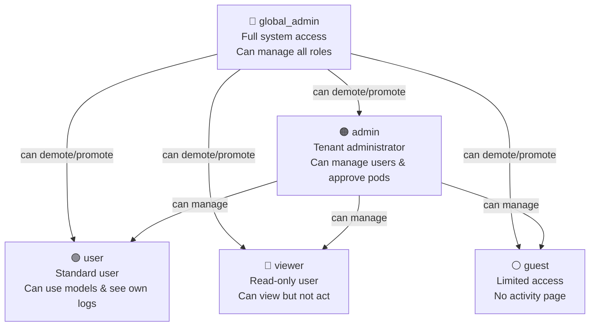

### Role Descriptions

| Role | Enum Value | Description |
|------|-----------|-------------|
| `global_admin` | `'global_admin'` | Platform-level superuser. Can see ALL audit records from all roles, assign any role, create users. The only role whose audit rows are hidden from regular admins. |
| `admin` | `'admin'` | Tenant/organization administrator. Can approve/reject pod activation requests, view audit records for `admin`, `user`, `viewer`, and `guest` roles. Cannot see `global_admin` audit rows. |
| `user` | `'user'` | Standard platform user. Can use AI models, submit pod activation requests, and view only their own activity logs. |
| `viewer` | `'viewer'` | Read-only role. Can view dashboards and their own logs but cannot trigger actions. |
| `guest` | `'guest'` | Most restricted. No access to the `/activity` frontend page (blocked by route guard). However, the database-level RLS policy "Users see own" applies to all authenticated users including guest — so a guest **can** query their own `auth_audit` and `audit_logs` rows directly via the Supabase SDK or API. The frontend page is the only access point that is blocked. |

---

## 3. Feature Capabilities by Role

### Activity Page (`/activity`)

| Capability | global_admin | admin | user | viewer | guest |
|-----------|:---:|:---:|:---:|:---:|:---:|
| Access `/activity` page | ✅ | ✅ | ✅ | ✅ | ❌ |
| View own audit rows (UI) | ✅ | ✅ | ✅ | ✅ | ❌ (page blocked) |
| View own audit rows (DB via RLS) | ✅ | ✅ | ✅ | ✅ | ✅ ¹ |
| View all `user` role rows | ✅ | ✅ | ❌ | ❌ | ❌ |
| View all `admin` role rows | ✅ | ✅ | ❌ | ❌ | ❌ |
| View all `viewer` role rows | ✅ | ✅ | ❌ | ❌ | ❌ |
| View all `guest` role rows | ✅ | ✅ | ❌ | ❌ | ❌ |
| View `global_admin` role rows | ✅ | ❌ | ❌ | ❌ | ❌ |

> ¹ **Guest DB-level note:** The RLS policy `"Users see own"` has no role restriction — it evaluates `user_id = auth.uid()` for all authenticated users, including guest. Guest rows are readable at the database level. The frontend `/activity` page is blocked by the route guard for UX/product reasons, not by RLS. This is an intentional design choice (permissive at DB, restricted at UI).

### Audit Events Generated

| Event | global_admin | admin | user | viewer | guest |
|-------|:---:|:---:|:---:|:---:|:---:|
| `login` logged | ✅ | ✅ | ✅ | ✅ | ✅ |
| `logout` logged | ✅ | ✅ | ✅ | ✅ | ✅ |
| `approve_pod:{model_id}` logged | ✅ | ✅ | ❌ | ❌ | ❌ |
| `reject_pod:{model_id}` logged | ✅ | ✅ | ❌ | ❌ | ❌ |

### Admin Capabilities

| Capability | global_admin | admin | user |
|-----------|:---:|:---:|:---:|
| View Admin Dashboard | ✅ | ✅ | ❌ |
| View Devices | ✅ | ✅ | ❌ |
| View Pending Approvals | ✅ | ✅ | ❌ |
| Approve/Reject Pod Requests | ✅ | ✅ | ❌ |
| List all users | ✅ | ✅ | ❌ |
| Create users | ✅ | ✅ | ❌ |
| Set user roles | ✅ | ❌ | ❌ |

---

## 4. Database Schema — Supabase Tables

### 4.1 `public.auth_audit` — Primary Activity Log Table

```sql
CREATE TABLE public.auth_audit (
    id              UUID        PRIMARY KEY DEFAULT gen_random_uuid(),
    user_id         UUID        NOT NULL REFERENCES auth.users(id),
    email           TEXT,
    role            TEXT,
    event           TEXT,
    created_at      TIMESTAMPTZ DEFAULT now(),
    action_code     TEXT,        -- ATNA: C, R, U, D, E
    outcome_code    INTEGER,     -- ATNA: 0, 4, 8, 12
    resource_type   TEXT,        -- e.g. auth_session, pod_activation
    resource_id     TEXT,
    integrity_hash  TEXT         -- SHA-256 of non-PII fields
);
```

**Row-Level Security:** ENABLED
**Indexes:** implicit on `id` (primary key)

---

### 4.2 `public.audit_logs` — Cryptographic Audit Ledger

> **Updated 2026-03-17:** Upgraded from a generic log table to a full cryptographic ledger with chain hashing, append-only enforcement, SHAP AI explainability columns, and before/after change tracking.

```sql
CREATE TABLE public.audit_logs (
    -- Core identity
    id              UUID        PRIMARY KEY DEFAULT gen_random_uuid(),
    user_id         UUID        REFERENCES auth.users(id),

    -- Action fields
    action          TEXT        NOT NULL,
    resource_type   TEXT        NOT NULL,
    resource_id     TEXT,
    details         JSONB,

    -- Change tracking (added 2026-03-16)
    previous_value  JSONB,       -- state before the action (PII-scrubbed)
    new_value       JSONB,       -- state after the action (PII-scrubbed)

    -- Request context
    ip_address      TEXT,
    user_agent      TEXT,
    created_at      TIMESTAMPTZ DEFAULT now(),

    -- Integrity (row-level hash, computed by application)
    integrity_hash  TEXT,        -- SHA-256 of all non-PII fields including SHAP data

    -- Cryptographic ledger (added 2026-03-17)
    sequence_num    BIGINT GENERATED ALWAYS AS IDENTITY,  -- monotonic insert order
    chain_hash      TEXT,        -- SHA-256(prev_chain_hash ∥ integrity_hash), set by DB trigger

    -- AI Explainability / SHAP (added 2026-03-17, nullable — AI decisions only)
    shap_values     JSONB,       -- {feature_name: shap_float, ...}
    model_id        TEXT,        -- model identifier (e.g. "fraud-detector-v3")
    prediction      JSONB,       -- model output / decision outcome
    reasoning       TEXT         -- auto-generated human-readable SHAP explanation
);

-- Standard indexes
CREATE INDEX idx_audit_logs_user_id       ON public.audit_logs (user_id);
CREATE INDEX idx_audit_logs_resource_type ON public.audit_logs (resource_type);
CREATE INDEX idx_audit_logs_created_at    ON public.audit_logs (created_at DESC);
CREATE INDEX idx_audit_logs_resource_id   ON public.audit_logs USING GIN (resource_id);

-- Ledger indexes (added 2026-03-17)
CREATE INDEX idx_audit_logs_sequence_num  ON public.audit_logs (sequence_num DESC);
CREATE INDEX idx_audit_logs_model_id      ON public.audit_logs (model_id) WHERE model_id IS NOT NULL;
```

**Row-Level Security:** ENABLED

**Append-Only Enforcement:** `BEFORE UPDATE` and `BEFORE DELETE` triggers on `audit_logs` raise an exception — rows cannot be modified or deleted after insertion. This is enforced at the database level, not just RLS.

**Chain Hash Trigger:** `compute_audit_chain_hash()` fires `BEFORE INSERT`, acquires an advisory lock to serialize concurrent inserts, and sets `chain_hash = SHA-256(prev_chain_hash ∥ integrity_hash)`. The genesis block uses the seed `'GENESIS'`.

---

### 4.3 `public.user_roles` — Role Assignment Table

```sql
CREATE TABLE public.user_roles (
    id        UUID     PRIMARY KEY DEFAULT gen_random_uuid(),
    user_id   UUID     NOT NULL REFERENCES auth.users(id) ON DELETE CASCADE,
    role      app_role NOT NULL,
    UNIQUE (user_id, role)
);
```

---

### 4.4 `public.roles` — Role Metadata Table

```sql
CREATE TABLE public.roles (
    id          UUID    PRIMARY KEY DEFAULT gen_random_uuid(),
    name        TEXT    UNIQUE NOT NULL,
    description TEXT,
    permissions JSONB
);
```

---

### 4.5 `public.device_sync_logs` — Device Sync Activity

```sql
CREATE TABLE public.device_sync_logs (
    id          UUID        PRIMARY KEY DEFAULT gen_random_uuid(),
    device_id   UUID        REFERENCES devices(id),
    event_type  TEXT,        -- check_in, model_sync, config_update
    details     JSONB,
    created_at  TIMESTAMPTZ DEFAULT now()
);
```

---

### 4.6 `public.device_usage_logs` — AI Model Usage Tracking

```sql
CREATE TABLE public.device_usage_logs (
    id           UUID        PRIMARY KEY DEFAULT gen_random_uuid(),
    device_id    UUID        REFERENCES devices(id),
    model_id     TEXT,
    prompt_count INTEGER,
    tokens_used  INTEGER,
    duration_ms  INTEGER,
    created_at   TIMESTAMPTZ DEFAULT now()
);
```

---

## 5. ER Diagram (Entity-Relationship)

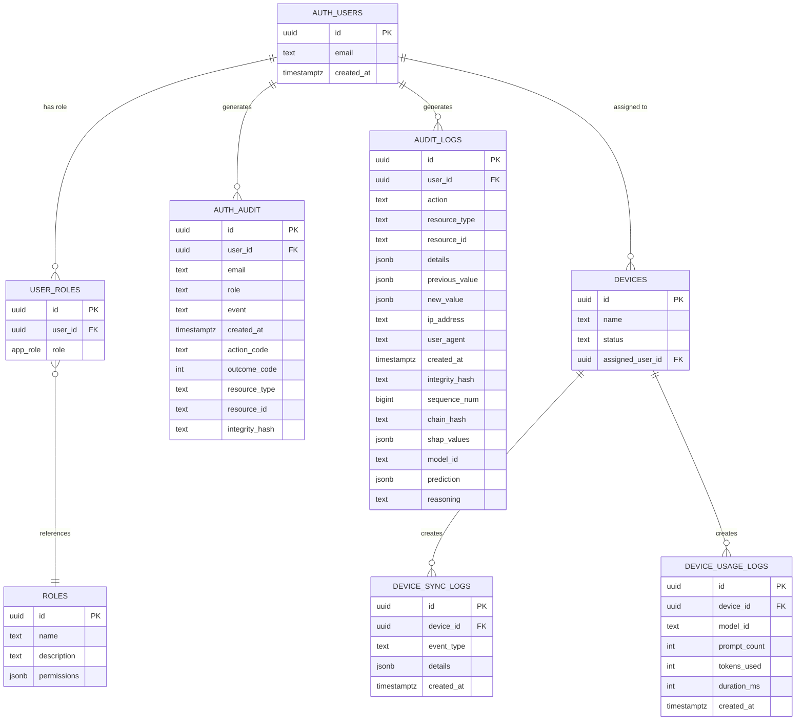

---

## 6. Schema Diagram — Supabase Column-Level Detail

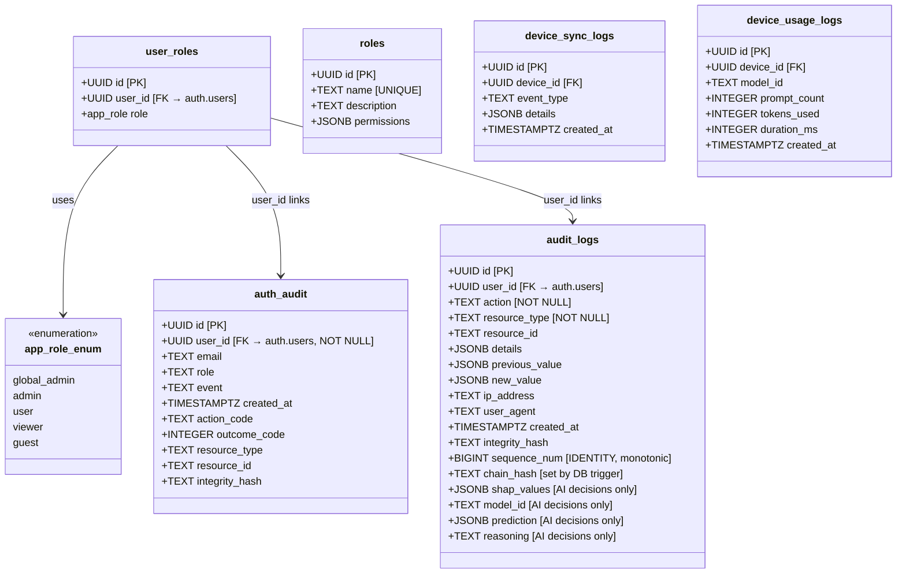

---

## 7. Row-Level Security (RLS) Policy Diagram

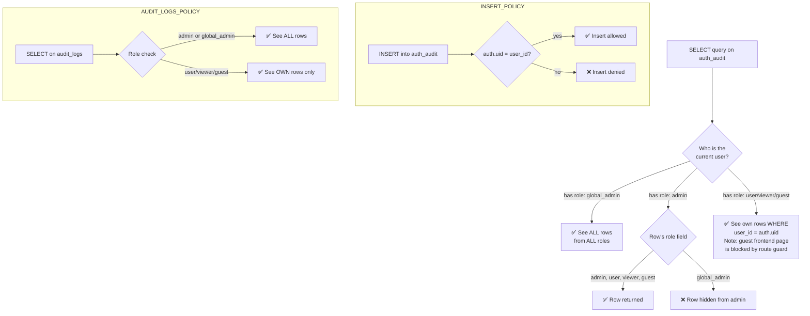

### RLS Policies Summary Table

| Table | Policy Name | Operation | Who | Condition |
|-------|------------|-----------|-----|-----------|
| `auth_audit` | Users insert own | INSERT | Any authenticated | `auth.uid() = user_id` |
| `auth_audit` | Users see own | SELECT | user/viewer/guest | `user_id = auth.uid()` |
| `auth_audit` | Admins see all except global_admin | SELECT | admin | `role IN ('admin','user','viewer','guest')` |
| `auth_audit` | Global admins see all | SELECT | global_admin | No restriction |
| `audit_logs` | System can insert | INSERT | Any | `true` (system writes) |
| `audit_logs` | Users see own | SELECT | Any | `auth.uid() = user_id` |
| `audit_logs` | Admins view all | SELECT | admin/global_admin | `has_role(auth.uid(), 'admin')` |
| `device_sync_logs` | Admins only view | SELECT | admin/global_admin | `has_role(auth.uid(), 'admin')` |
| `device_usage_logs` | Admins only view | SELECT | admin/global_admin | `has_role(auth.uid(), 'admin')` |

---

## 8. Data Flow Diagram — How Logs Are Created

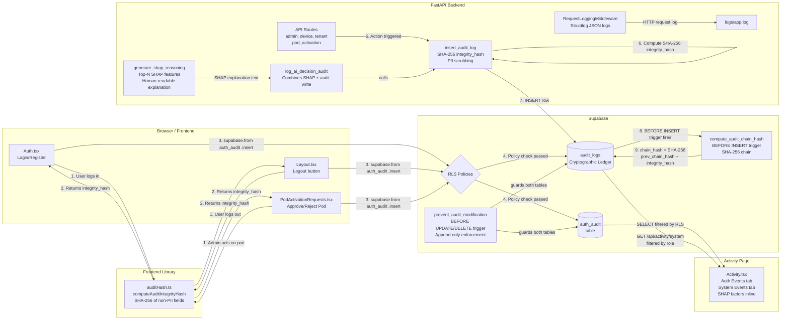

---

## 9. Sequence Diagram — Login Audit Event

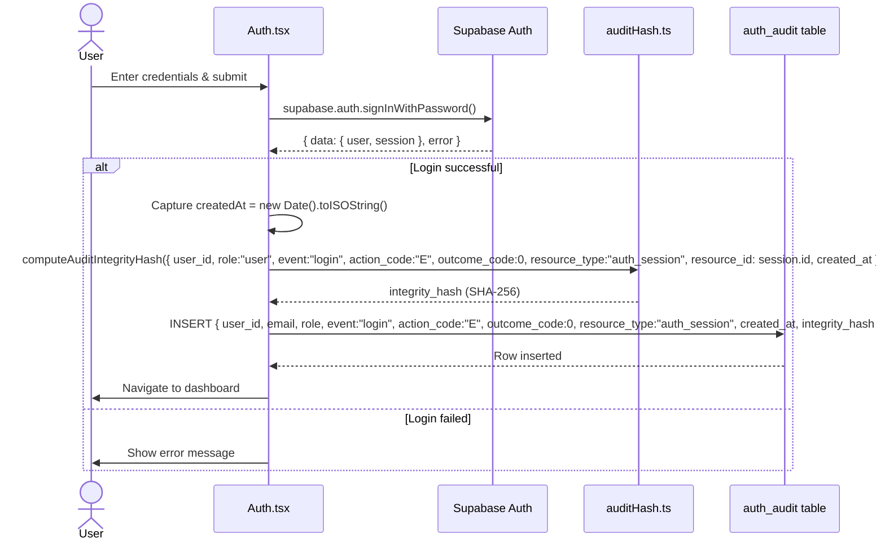

---

## 10. Sequence Diagram — Admin Approves Pod

```mermaid
sequenceDiagram
    actor Admin
    participant PAR as PodActivationRequests.tsx
    participant Supa as Supabase DB
    participant Hash as auditHash.ts
    participant AA as auth_audit table
    participant PODS as pod_activation_requests table

    Admin->>PAR: Click "Approve" on pod request
    PAR->>Supa: getUser() — verify session
    Supa-->>PAR: { user }

    PAR->>Supa: UPDATE pod_activation_requests\nSET status='approved'\nWHERE id = request.id
    Supa-->>PAR: Updated

    PAR->>PAR: createdAt = new Date().toISOString()
    PAR->>Hash: computeAuditIntegrityHash({ user_id, role:"admin", event:"approve_pod:{model_id}", action_code:"U", outcome_code:0, resource_type:"pod_activation", resource_id: request.id, created_at })
    Hash-->>PAR: integrity_hash (SHA-256)

    PAR->>AA: INSERT { user_id, email, role:"admin", event:"approve_pod:{model_id}", action_code:"U", outcome_code:0, resource_type:"pod_activation", resource_id, created_at, integrity_hash }
    AA-->>PAR: Row inserted

    PAR->>Admin: Toast: "Pod approved successfully"
```

---

## 11. Sequence Diagram — Viewing Activity Logs

```mermaid
sequenceDiagram
    actor Actor as User / Admin / Global Admin
    participant ACT as Activity.tsx
    participant RLS as Supabase RLS
    participant AA as auth_audit table

    Actor->>ACT: Navigate to /activity
    ACT->>ACT: useEffect — fetch on mount

    ACT->>RLS: SELECT * FROM auth_audit\nORDER BY created_at DESC
    RLS->>RLS: Evaluate caller's role

    alt Caller is global_admin
        RLS-->>ACT: ALL rows (all roles)
    else Caller is admin
        RLS-->>ACT: Rows WHERE role IN\n('admin','user','viewer','guest')
    else Caller is user / viewer
        RLS-->>ACT: Rows WHERE user_id = auth.uid()
    else Caller is guest
        RLS-->>ACT: Guest cannot reach this page\n(route guard redirects to / before query)\nDirect DB query would return own rows\nvia "Users see own" policy (user_id = auth.uid())
    end

    ACT->>ACT: setRows(data)\nRender table with badges
    ACT->>Actor: Display filtered activity log
```

---

## 12. Component Architecture Diagram

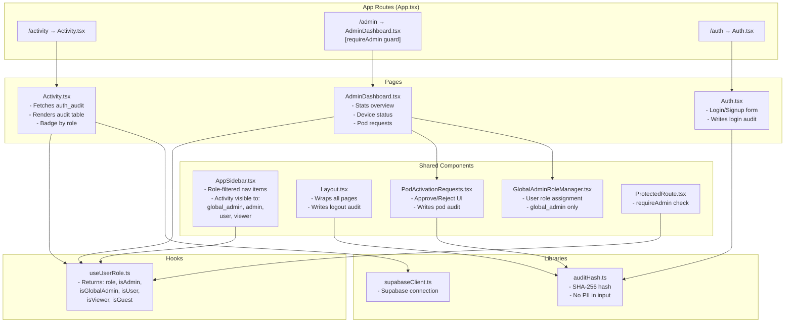

---

## 13. Audit Integrity Hash Flow

### 13.1 `auth_audit` — Frontend SHA-256 Hash (`auditHash.ts`)

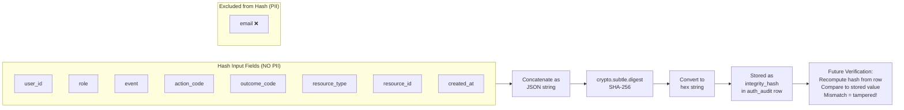

### 13.2 `audit_logs` — Backend SHA-256 Hash + Cryptographic Chain (`supabase.py` + DB trigger)

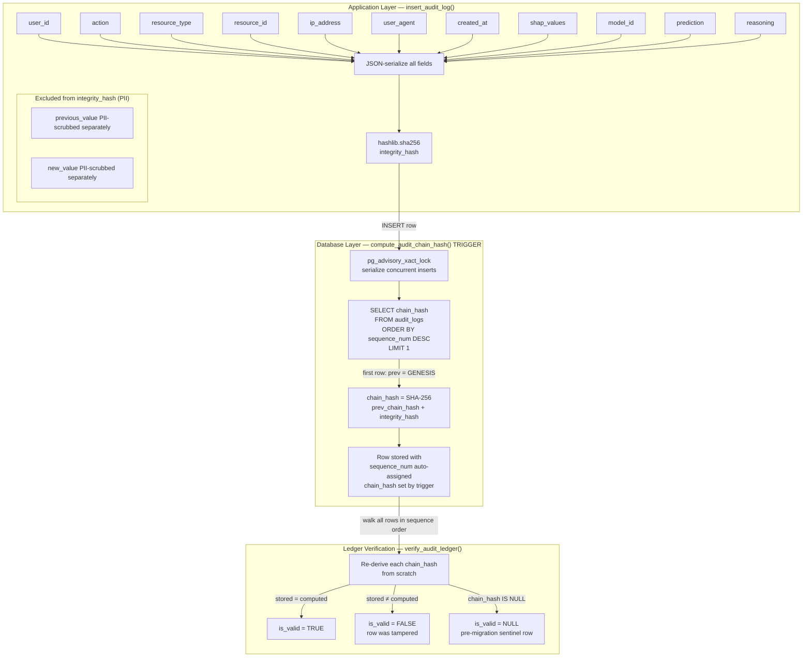

### Why the Two-Layer Hash Matters

| Layer | Table | Computed By | Covers | Detects |
|-------|-------|------------|--------|---------|
| `integrity_hash` | `auth_audit`, `audit_logs` | Application (Python / JS) | All non-PII fields of **one row** | Single-row tampering |
| `chain_hash` | `audit_logs` only | DB trigger | Links **every row** to predecessor | Row insertion, deletion, or reordering anywhere in history |

- Any modification to a row's fields breaks its `integrity_hash`.
- Any insertion, deletion, or reordering of rows breaks the `chain_hash` of every subsequent row.
- For `auth_audit`, email is excluded from the hash to protect PII (email is stored in the row but not hashed).
- For `audit_logs`, SHAP values (`shap_values`, `model_id`, `prediction`, `reasoning`) are **included** in `integrity_hash` — tampering with AI explainability data is detectable.

---

## 14. Event Types Reference

| Event | Trigger | Actor | action_code | outcome_code | resource_type |
|-------|---------|-------|:-----------:|:------------:|---------------|
| `login` | Successful sign-in | Any role | `E` (Execute) | `0` (Success) | `auth_session` |
| `logout` | Sign-out click | Any role | `E` (Execute) | `0` (Success) | `auth_session` |
| `approve_pod:{model_id}` | Admin approves pod activation | admin / global_admin | `U` (Update) | `0` (Success) | `pod_activation` |
| `reject_pod:{model_id}` | Admin rejects pod activation | admin / global_admin | `U` (Update) | `0` (Success) | `pod_activation` |

---

## 15. ATNA Standard Code Reference

### Action Codes

| Code | Meaning | Used For | Status |
|------|---------|---------|--------|
| `C` | Create | Creating new resources (e.g. user creation events) | **Planned** — no events assigned yet |
| `R` | Read | Reading/viewing records (e.g. document view events) | **Planned** — no events assigned yet |
| `U` | Update | Modifying existing records | **Active** — `approve_pod`, `reject_pod` |
| `D` | Delete | Deleting records | **Planned** — no events assigned yet |
| `E` | Execute | Executing operations | **Active** — `login`, `logout` |

### Outcome Codes

| Code | Meaning | Severity |
|------|---------|---------|
| `0` | Success | None — operation completed normally |
| `4` | Minor failure | Low — minor issue occurred |
| `8` | Serious failure | High — significant problem |
| `12` | Major failure | Critical — severe error |

---

## 16. Access Control Matrix

### `/activity` Page — What Each Role Sees

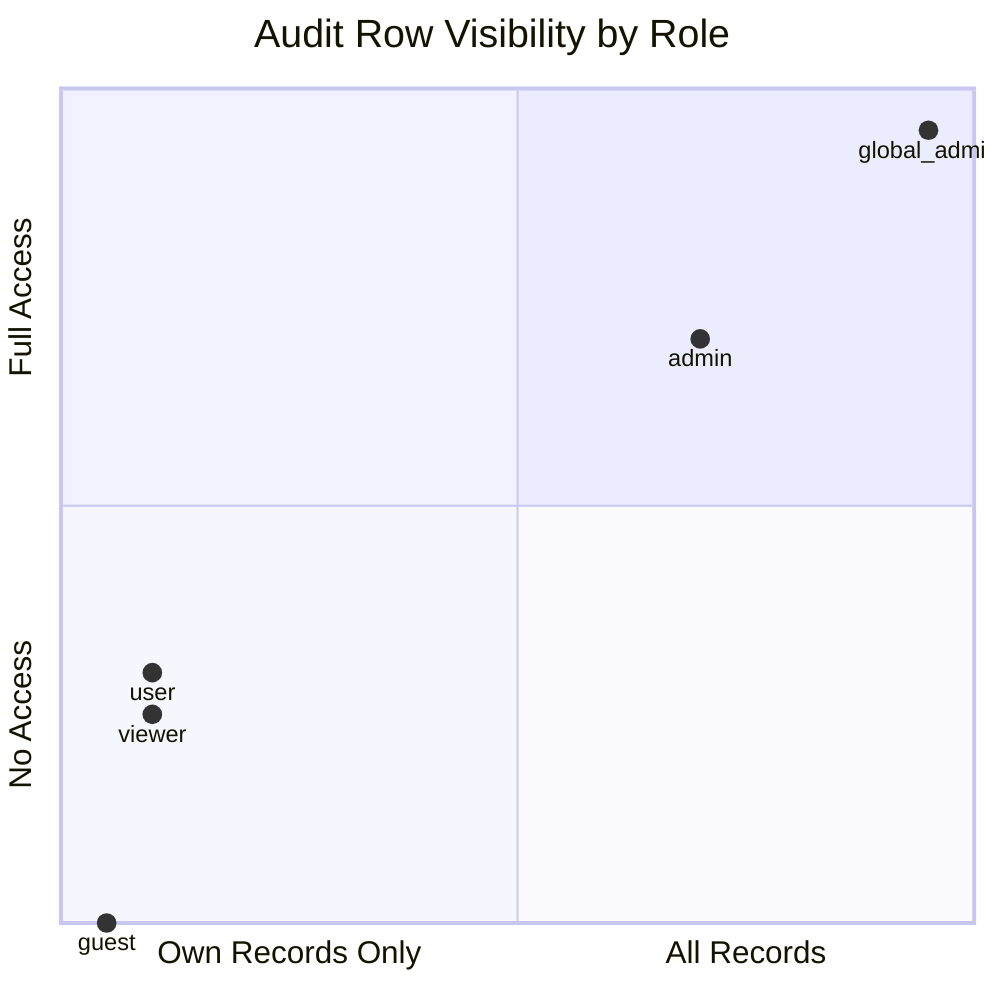

### Detailed Access Matrix

| Data Scope | global_admin | admin | user | viewer | guest |
|-----------|:---:|:---:|:---:|:---:|:---:|
| Own `auth_audit` rows (DB via RLS) | ✅ | ✅ | ✅ | ✅ | ✅ ¹ |
| All `user` role rows | ✅ | ✅ | ❌ | ❌ | ❌ |
| All `admin` role rows | ✅ | ✅ ² | ❌ | ❌ | ❌ |
| All `viewer` role rows | ✅ | ✅ | ❌ | ❌ | ❌ |
| All `guest` role rows | ✅ | ✅ | ❌ | ❌ | ❌ |
| `global_admin` role rows | ✅ | ❌ | ❌ | ❌ | ❌ |
| All `audit_logs` rows | ✅ | ✅ | ❌ | ❌ | ❌ |
| Own `audit_logs` rows (DB via RLS) | ✅ | ✅ | ✅ | ✅ | ✅ ¹ |
| `device_sync_logs` | ✅ | ✅ | ❌ | ❌ | ❌ |
| `device_usage_logs` | ✅ | ✅ | ❌ | ❌ | ❌ |

> ¹ **Guest DB access:** Guest users can read their own `auth_audit` and `audit_logs` rows at the database level via the `"Users see own"` RLS policy (`user_id = auth.uid()`). The frontend `/activity` page is blocked by the route guard — DB-level access exists but is not exposed in the UI. This is intentional: permissive at DB, restricted at UI layer.
>
> ² **Cross-admin visibility (intentional by design):** An `admin` can read the full audit trail of **other admins** within the same tenant (`role IN ('admin','user','viewer','guest')` includes all admin rows). This is deliberate for accountability — any admin action is visible to other admins and to `global_admin`. This is **not** a privilege escalation: admins cannot see `global_admin` rows, and cannot modify any audit row (no UPDATE/DELETE policy exists).

### API Endpoint Access Matrix

| Endpoint | global_admin | admin | user | viewer | guest |
|---------|:---:|:---:|:---:|:---:|:---:|
| `GET /api/list-users` | ✅ | ✅ | ❌ | ❌ | ❌ |
| `POST /api/admin-create-user` | ✅ | ✅ | ❌ | ❌ | ❌ |
| `POST /api/admin-set-user-role` | ✅ | ❌ | ❌ | ❌ | ❌ |

---

## 17. Navigation & Route Guard Diagram

```mermaid
flowchart TD
    START([User navigates to URL])
    START --> AUTH_CHK{Is user\nauthenticated?}

    AUTH_CHK -->|No| LOGIN[Redirect to /auth]
    AUTH_CHK -->|Yes| ROLE_FETCH[Fetch role from\nuser_roles table]

    ROLE_FETCH --> ROUTE{Which route?}

    ROUTE -->|/activity| ACT_CHK{Role is\nglobal_admin, admin,\nuser, or viewer?}
    ROUTE -->|/admin| ADMIN_CHK{requireAdmin:\nrole is admin\nor global_admin?}
    ROUTE -->|/devices| ADMIN_CHK
    ROUTE -->|/devices/pending| ADMIN_CHK

    ACT_CHK -->|Yes| SHOW_ACT[Show Activity.tsx\nFiltered by RLS]
    ACT_CHK -->|No (guest)| REDIRECT[Not shown in sidebar\nRedirect if direct nav]

    ADMIN_CHK -->|Yes| SHOW_ADMIN[Show Admin page]
    ADMIN_CHK -->|No| DENY[Redirect to /]

    subgraph SIDEBAR_RENDER["Sidebar Navigation Rendering"]
        SB_ACT[Activity — shown to:\nglobal_admin, admin, user, viewer]
        SB_ADMIN[Admin Dashboard — shown to:\nadmin, global_admin]
        SB_DEVICES[Devices — shown to:\nadmin, global_admin]
        SB_PENDING[Pending Approvals — shown to:\nadmin, global_admin]
    end
```

---

## 18. Backend Logging Architecture

```mermaid
flowchart LR
    subgraph FASTAPI["FastAPI Application"]
        FACTORY[factory.py\napp = create_app()]
        MW[RequestLoggingMiddleware]
        ROUTES[API Routes\nadmin.py, device.py,\ntenants.py, pod_activation.py]
    end

    subgraph LOGGER["Logger Module (logger/__init__.py)"]
        STRUCTLOG[structlog\nJSON formatter\nRotating file handler]
        PII[PII Scrubber — Pass 1\nField-name match → REDACTED\nMasks: email → u***@domain]
        PRESIDIO[Presidio — Pass 2\nContent scan: PERSON, EMAIL,\nPHONE, CREDIT_CARD, SSN,\nIBAN, LOCATION]
        SHAP_ENGINE[SHAP Reasoning Engine\ngenerate_shap_reasoning\nTop-N feature contributions\nHuman-readable explanation]
        AI_AUDIT[log_ai_decision_audit\nAsync convenience wrapper\nSHAP + audit ledger write]
    end

    subgraph OUTPUT["Log Output"]
        CONSOLE[Console\nJSON output]
        FILE[logs/app.log\nJSON lines\n10 MB rotate / 5 backups]
        DB_AL[(audit_logs\nCryptographic Ledger)]
    end

    subgraph LOG_FIELDS["Per-Request Log Fields"]
        LF1[request_id: UUID]
        LF2[method: GET/POST/etc]
        LF3[path: /api/...]
        LF4[client_ip: x.x.x.x]
        LF5[status_code: 200/401/etc]
        LF6[duration_ms: float]
    end

    subgraph AI_LOG_FIELDS["AI Decision Audit Fields"]
        AF1[model_id: identifier]
        AF2[shap_values: feature contributions]
        AF3[prediction: model output]
        AF4[reasoning: human-readable text]
        AF5[integrity_hash: SHA-256]
        AF6[chain_hash: ledger link]
    end

    FACTORY --> MW
    MW --> ROUTES
    MW --> STRUCTLOG
    STRUCTLOG --> PII
    PII --> PRESIDIO
    PRESIDIO --> CONSOLE
    PRESIDIO --> FILE

    ROUTES --> SHAP_ENGINE
    SHAP_ENGINE --> AI_AUDIT
    AI_AUDIT --> DB_AL
    AI_AUDIT --> STRUCTLOG

    MW --> LOG_FIELDS
    AI_AUDIT --> AI_LOG_FIELDS
```

### Backend vs Frontend Logging Comparison

| Aspect | Frontend (`auth_audit` table) | Backend (`logs/app.log`) | Backend (`audit_logs` ledger) |
|--------|------------------------------|-------------------------|-------------------------------|
| Storage | Supabase PostgreSQL | Local file system | Supabase PostgreSQL |
| Format | Structured table rows | JSON lines (structlog) | Structured rows + JSONB |
| PII Handling — Pass 1 | Email stored, excluded from hash | Field-name keyword match → `[REDACTED]`; email → `u***@domain` | `_scrub_audit_value()` before storage |
| PII Handling — Pass 2 | Regex content scan (SSN, card, phone, IBAN) | **Presidio** content scan (PERSON, EMAIL, PHONE, CREDIT_CARD, US_SSN, IBAN, LOCATION) | Presidio via `scrub_text()` |
| Tamper Evidence | SHA-256 `integrity_hash` | No hash (file-based) | SHA-256 `integrity_hash` + SHA-256 `chain_hash` |
| Append-Only | RLS (no DELETE policy) | File append-only (OS) | DB trigger raises exception on UPDATE/DELETE |
| AI Explainability | — | — | `shap_values`, `model_id`, `prediction`, `reasoning` |
| Queryable | Yes — via Supabase SQL/RLS | No — file read only | Yes — `GET /api/activity/system` |
| Retention | Permanent (no delete policy) | File rotation (10 MB × 5 = 50 MB max) | Permanent (append-only, no delete policy) |
| Visibility | Role-filtered via RLS | Server-side only | Role-filtered via FastAPI endpoint |
| Compliance | ATNA | Operational debug | EU AI Act Art.12/13, SOC2 CC7.2 |

---

## 19. Full System Interaction Diagram

```mermaid
flowchart TB
    subgraph USERS["Users"]
        GA_U[global_admin user]
        A_U[admin user]
        U_U[standard user]
    end

    subgraph FRONTEND["Next.js / React Frontend"]
        AUTH_C[Auth.tsx]
        ACT_C[Activity.tsx\nAuth Events tab\nSystem Events tab\nShapFactors component]
        ADMIN_C[AdminDashboard.tsx]
        PAR_CC[PodActivationRequests.tsx]
        HASH_L[auditHash.ts\nSHA-256 integrity hash]
        SIDEBAR_C[AppSidebar.tsx]
        LAYOUT_CC[Layout.tsx]
        URH_H[useUserRole hook]
        FE_LOG[frontend/logger/index.ts\nPino + PII scrubber]
    end

    subgraph SUPABASE["Supabase Platform"]
        subgraph AUTH_S["Auth Service"]
            SESS[Session Management]
        end
        subgraph DB["PostgreSQL Database"]
            UR[user_roles]
            AA_T[auth_audit\nSHA-256 integrity_hash]
            AL_T[audit_logs\nCryptographic Ledger\nsequence_num + chain_hash\nSHAP columns\nAppend-only triggers]
            DSL[device_sync_logs]
            DUL[device_usage_logs]
        end
        subgraph RLS_S["Row-Level Security"]
            RLS_AA[auth_audit policies]
            RLS_AL[audit_logs policies]
        end
        subgraph TRIGGERS["DB Triggers"]
            CHT[compute_audit_chain_hash\nBEFORE INSERT]
            IMM[prevent_audit_modification\nBEFORE UPDATE/DELETE]
        end
    end

    subgraph BACKEND["FastAPI Backend"]
        ADMIN_R[admin.py routes\ncreate_user, set_role]
        DEV_R[device.py routes]
        TENANT_R[tenants.py routes]
        POD_R[pod_activation.py routes]
        ACT_R[activity.py\nGET /api/activity/system]
        LOG_MW[RequestLoggingMiddleware\nstructlog JSON]
        LOGF[logs/app.log\n10 MB rotate / 5 backups]
        AUDIT_W[insert_audit_log\nsupabase.py\nSHA-256 + PII scrub]
        SHAP_R[generate_shap_reasoning\nlogger/__init__.py]
        AI_W[log_ai_decision_audit\nlogger/__init__.py]
    end

    GA_U -->|uses| FRONTEND
    A_U -->|uses| FRONTEND
    U_U -->|uses| FRONTEND

    FRONTEND -->|auth calls| AUTH_S
    FRONTEND -->|DB reads/writes via SDK| RLS_S

    AUTH_C -->|on login/logout| HASH_L
    LAYOUT_CC -->|on logout| HASH_L
    PAR_CC -->|on approve/reject| HASH_L
    HASH_L -->|integrity_hash| AA_T

    RLS_S -->|enforces| DB
    URH_H -->|reads| UR

    FRONTEND -->|API calls| BACKEND
    BACKEND -->|role check| SUPABASE
    LOG_MW -->|writes| LOGF

    ADMIN_R -->|calls| AUDIT_W
    DEV_R -->|calls| AUDIT_W
    TENANT_R -->|calls| AUDIT_W
    POD_R -->|calls| AUDIT_W
    SHAP_R -->|reasoning text| AI_W
    AI_W -->|calls| AUDIT_W
    AUDIT_W -->|INSERT| AL_T
    AL_T -->|BEFORE INSERT| CHT
    IMM -->|guards| AA_T
    IMM -->|guards| AL_T

    ACT_C -->|SELECT filtered by RLS| RLS_AA
    RLS_AA --> AA_T
    ACT_C -->|GET /api/activity/system| ACT_R
    ACT_R -->|SELECT + role filter| AL_T

    FE_LOG -->|safe client logs| FRONTEND
```

---

## 20. PII Detection — Presidio & Regex

All log data passes through a **two-pass PII scrubbing pipeline** before being written to any output, implemented in `backend/app/logger/__init__.py` (Python) and `frontend/src/logger/index.ts` (TypeScript).

### Pass 1 — Field-name Keyword Match (fast)

Every key in the log payload is compared (case-insensitive) against a hard-coded set of sensitive field names. A match unconditionally replaces the value with `[REDACTED]`.

**Covered fields (20 total):** `password`, `passwd`, `secret`, `token`, `api_key`, `authorization`, `ssn`, `social_security`, `credit_card`, `card_number`, `cvv`, `dob`, `date_of_birth`, `birth_date`, `full_name`, `first_name`, `last_name`, `mobile`, `phone`, `phone_number`, `address`

### Pass 2 — Content-based PII Detection (deep scan)

After field-name scrubbing, all remaining **string values** are scanned for PII content — catching sensitive data inside generic fields like `message` or `details` regardless of the key name.

#### Email Pre-masking (shared — both backend & frontend)

Before the deep scan, email addresses are masked to `u***@domain.com` format (cheaper than NLP/regex scan).

#### Backend — Microsoft Presidio (Python)

```python
from presidio_analyzer import AnalyzerEngine
from presidio_anonymizer import AnonymizerEngine
from presidio_anonymizer.entities import OperatorConfig

_analyzer = AnalyzerEngine()   # uses spaCy en_core_web_sm model
_anonymizer = AnonymizerEngine()
```

Detected entities are replaced with `<ENTITY_TYPE>` placeholders via `OperatorConfig("replace")`.

**Graceful degradation:** If Presidio or the spaCy model is unavailable, `_PRESIDIO_AVAILABLE = False` and only Pass 1 runs — no exception is raised.

#### Frontend — Regex Patterns (TypeScript)

```typescript
const PII_PATTERNS: PiiPattern[] = [
  { label: "US_SSN",       regex: /\b\d{3}-\d{2}-\d{4}\b/g },
  { label: "CREDIT_CARD",  regex: /\b(?:\d[ -]?){13,15}\d\b/g },
  { label: "PHONE_NUMBER", regex: /(?:\+\d{1,3}[\s.-]?)?(?:\(?\d{3}\)?[\s.-]?)(?:\d{3}[\s.-]?\d{4})/g },
  { label: "EMAIL_ADDRESS", regex: /[a-zA-Z0-9._%+\-]+@[a-zA-Z0-9.\-]+\.[a-zA-Z]{2,}/g },
  { label: "IBAN_CODE",    regex: /\b[A-Z]{2}\d{2}[A-Z0-9]{4}\d{7}(?:[A-Z0-9]?){0,16}\b/g },
];
```

No ML model required — runs in browser or Node.js with zero additional dependencies.

### Entity Type Reference

| Entity Type | Example Input | Replacement | Backend | Frontend |
|-------------|--------------|-------------|---------|----------|
| `PERSON` | John Smith | `<PERSON>` | Presidio NLP | — |
| `EMAIL_ADDRESS` | user@example.com | `u***@example.com` | Email mask + Presidio | Email mask + regex |
| `PHONE_NUMBER` | +1 (555) 123-4567 | `<PHONE_NUMBER>` | Presidio NLP | Regex |
| `CREDIT_CARD` | 4111 1111 1111 1111 | `<CREDIT_CARD>` | Presidio NLP | Regex |
| `US_SSN` | 123-45-6789 | `<US_SSN>` | Presidio NLP | Regex |
| `IBAN_CODE` | GB29NWBK60161331926819 | `<IBAN_CODE>` | Presidio NLP | Regex |
| `LOCATION` | New York, NY | `<LOCATION>` | Presidio NLP | — |
| `IP_ADDRESS` | 192.168.1.1 | *(kept)* | Intentionally excluded | — |

> **Note:** `IP_ADDRESS` is excluded from Presidio detection — client IPs are useful for security forensics in HTTP request logs.

### Backend Dependencies (`requirements.txt`)

```
presidio-analyzer>=2.2.0
presidio-anonymizer>=2.2.0
spacy>=3.4.0,<4.0.0
en-core-web-sm @ https://github.com/explosion/spacy-models/releases/download/en_core_web_sm-3.7.1/en_core_web_sm-3.7.1-py3-none-any.whl
```

### Installation

```bash
pip install -r requirements.txt
# or manually:
pip install presidio-analyzer presidio-anonymizer spacy
python -m spacy download en_core_web_sm
```

---

---

## 21. Cryptographic Audit Ledger

> **Added:** 2026-03-17 — migrations `20260317000002_audit_ledger_shap.sql` and `20260317000003_verify_audit_ledger_fix.sql`

### Overview

The `audit_logs` table has been upgraded from a conventional log table to a **cryptographic append-only ledger** — analogous to a simplified blockchain. Every row is linked to its predecessor via a SHA-256 chain hash. Any attempt to insert, delete, reorder, or modify any row will invalidate every `chain_hash` from that row onward, making tampering detectable.

### Chain Hash Formula

```
chain_hash[0]   = SHA-256("GENESIS" || integrity_hash[0])     -- genesis block
chain_hash[N]   = SHA-256(chain_hash[N-1] || integrity_hash[N]) -- subsequent blocks
```

- `sequence_num`: `BIGINT GENERATED ALWAYS AS IDENTITY` — strictly monotonic, assigned by PostgreSQL, never supplied by the caller.
- `chain_hash`: computed exclusively by the `compute_audit_chain_hash()` `BEFORE INSERT` trigger — the caller's value is always overwritten.
- `integrity_hash`: SHA-256 over all non-PII application-layer fields including SHAP data (computed by `insert_audit_log()` in Python before the INSERT).

### Ledger Trigger — `compute_audit_chain_hash()`

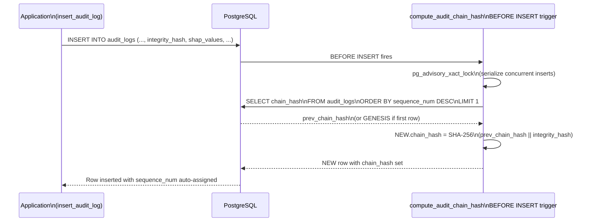

### Append-Only Enforcement — `prevent_audit_modification()`

A separate trigger fires `BEFORE UPDATE` or `BEFORE DELETE` on both `auth_audit` and `audit_logs`:

```sql
-- Any UPDATE or DELETE raises an exception
RAISE EXCEPTION 'Audit records are immutable and cannot be modified or deleted.';
```

This makes the append-only property a **hard database constraint**, not just an RLS policy gap.

### Ledger Verification — `verify_audit_ledger()`

Compliance auditors can verify the full ledger at any time:

```sql
-- Check for any tampered rows:
SELECT * FROM public.verify_audit_ledger() WHERE NOT is_valid;

-- Full ledger walk:
SELECT * FROM public.verify_audit_ledger() ORDER BY sequence_num;
```

**Return columns:**

| Column | Type | Meaning |
|--------|------|---------|
| `sequence_num` | BIGINT | Insert order |
| `id` | UUID | Row identifier |
| `stored_chain` | TEXT | `chain_hash` value stored in the row |
| `computed_chain` | TEXT | Hash re-derived from scratch by the function |
| `is_valid` | BOOLEAN | `TRUE` if match, `FALSE` if tampered, `NULL` if pre-migration sentinel |

**Pre-migration rows** (inserted before the 2026-03-17 migration) have `chain_hash = NULL`. The fixed `verify_audit_ledger()` (migration `20260317000003`) returns these as sentinel rows (`is_valid = NULL`) without advancing `prev_chain`, so the post-migration chain verifies correctly from the first chained row onward.

### Compliance Coverage

| Standard | Article / Control | Requirement | Ledger Feature |
|----------|------------------|-------------|----------------|
| EU AI Act | Art. 12 — Record-keeping | AI systems must log decisions with sufficient detail | `shap_values`, `model_id`, `prediction`, `reasoning` stored per decision |
| EU AI Act | Art. 13 — Transparency | Explainability for high-risk AI | Human-readable `reasoning` auto-generated from SHAP |
| SOC 2 | CC7.2 — System Monitoring | Detect and respond to unauthorized activity | `verify_audit_ledger()` detects any tampered row |
| NAIC AI Bulletin | AI model governance | Audit trail for AI-driven decisions | Full decision + SHAP trace per row |

---

## 22. SHAP AI Explainability Integration

> **Added:** 2026-03-17 — `backend/app/logger/__init__.py` + migration `20260317000002_audit_ledger_shap.sql`

### Overview

When an AI model makes a decision (risk assessment, fraud detection, recommendation, etc.), the platform captures the **SHAP (SHapley Additive exPlanations)** feature contributions alongside the prediction and stores them in the `audit_logs` ledger. A human-readable explanation is auto-generated from the SHAP values and stored in the `reasoning` column.

### SHAP Columns in `audit_logs`

| Column | Type | Description |
|--------|------|-------------|
| `shap_values` | `JSONB` | `{"feature_name": shap_float, ...}` — positive values increase prediction, negative decrease |
| `model_id` | `TEXT` | Human-readable model identifier, e.g. `"fraud-detector-v3"` |
| `prediction` | `JSONB` | Model output — e.g. `{"label": "high_risk", "confidence": 0.87}` |
| `reasoning` | `TEXT` | Auto-generated sentence — e.g. `"Model 'fraud-v3' predicted 'high_risk' (confidence 87.0%). Top factors: transaction_amount (+0.4200, ↑), account_age (-0.3100, ↓)."` |

All four columns are **included in `integrity_hash`** — tampering with any AI explainability field is detectable.

### `generate_shap_reasoning()` — Auto-explanation Generator

Located in `backend/app/logger/__init__.py`.

```python
reasoning = generate_shap_reasoning(
    shap_values={"transaction_amount": 0.42, "account_age": -0.31, "hour_of_day": 0.18},
    prediction={"label": "high_risk", "confidence": 0.87},
    model_id="fraud-v3",
    top_n=5,
)
# → "Model 'fraud-v3' predicted 'high_risk' (confidence 87.0%). 
#    Top factors: transaction_amount (+0.4200, ↑), account_age (-0.3100, ↓), hour_of_day (+0.1800, ↑)."
```

**Algorithm:**
1. Sort features by absolute SHAP value (most influential first).
2. Take top `N` features.
3. Render `prediction` as a string — handles both scalar and dict (extracts `label`/`class` and `confidence`/`score`).
4. Format each feature as `feature_name (±value, ↑/↓)`.
5. Return a single sentence.

### `log_ai_decision_audit()` — Convenience Wrapper

Combines SHAP reasoning generation with the audit ledger write in one async call:

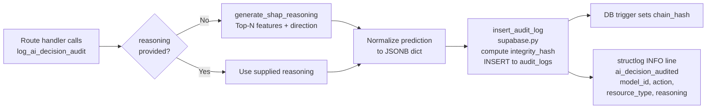

**Usage example:**

```python
await log_ai_decision_audit(
    request=request,
    user_id=current_user["id"],
    action="risk_assessment",
    resource_type="transaction",
    resource_id=transaction_id,
    model_id="fraud-detector-v3",
    shap_values={"amount": 0.42, "account_age": -0.31, "hour": 0.18},
    prediction={"label": "high_risk", "confidence": 0.87},
)
```

### Frontend — `ShapFactors` Component (`Activity.tsx`)

The System Events tab in `Activity.tsx` renders SHAP values inline for any row with `shap_values` populated:

- Top 3 features sorted by absolute SHAP magnitude are displayed.
- Positive values show a **green ↑** badge.
- Negative values show a **red ↓** badge.
- The full `reasoning` text is also displayed as an expandable AI Reasoning section.

### SHAP Data Flow

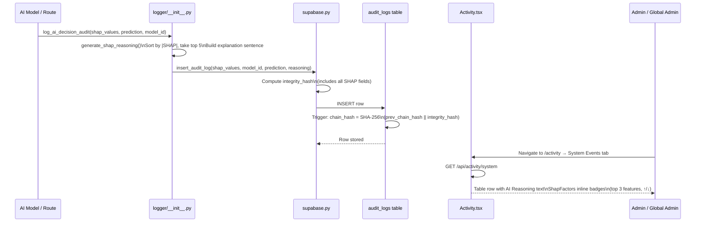

---

## 23. Backend Audit Write Architecture

> **Added:** `backend/app/core/supabase.py` — `insert_audit_log()` function

### `insert_audit_log()` — Central Audit Write

All backend routes call a single `insert_audit_log()` function to persist audit rows. This function:

1. **Computes `integrity_hash`**: SHA-256 over all non-PII structured fields — `user_id`, `action`, `resource_type`, `resource_id`, `ip_address`, `user_agent`, `created_at`, `shap_values`, `model_id`, `prediction`, `reasoning`.
2. **Scrubs PII** from `previous_value` and `new_value` using `_scrub_audit_value()` before storage.
3. **Silently swallows exceptions** — audit failures never block the main request path.
4. Writes to `audit_logs` via PostgREST; the DB trigger then sets `chain_hash`.

### Routes That Write Audit Rows

| Route | Action | Fields Captured |
|-------|--------|----------------|
| `POST /api/admin-create-user` | `create_user` | `new_value: {role}` |
| `POST /api/admin-set-user-role` | `set_user_role` | `previous_value: {role}`, `new_value: {role}` |
| `POST /api/admin-create-user` (password update) | `update_password` | No values stored |
| `POST /api/v1/pods/approve` | `approve_pod` | Pod resource details |
| `POST /api/v1/pods/reject` | `reject_pod` | Pod resource details |
| Device registration / deactivation | `register_device`, `deactivate_device` | Device resource details |
| Tenant provisioning | `create_tenant`, `provision_admin` | Tenant / user details |
| AI model decisions (via `log_ai_decision_audit`) | Any | Full SHAP + prediction |

### `GET /api/activity/system` — System Events Endpoint (`activity.py`)

Returns paginated `audit_logs` rows with role-based filtering:

| Caller Role | Rows Returned |
|-------------|--------------|
| `global_admin` | All rows |
| `admin` | All rows |
| `user` / `viewer` | Only own rows (`user_id = caller`) |
| `guest` | 403 Forbidden |

**Fields returned** (includes all ledger columns):
`id`, `user_id`, `action`, `resource_type`, `resource_id`, `details`, `previous_value`, `new_value`, `ip_address`, `user_agent`, `created_at`, `integrity_hash`, `sequence_num`, `chain_hash`, `shap_values`, `model_id`, `prediction`, `reasoning`

**Supported filters:** `action`, `resource_type`, `date_from`, `date_to`

---

## 24. Audit Ledger Verification Flow

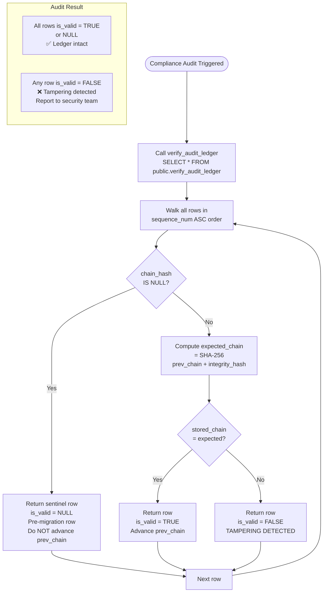

### Interpreting Results

| `is_valid` | Meaning | Action |
|-----------|---------|--------|
| `TRUE` | Row hash matches — not tampered | None required |
| `FALSE` | Stored chain ≠ computed chain — row inserted, deleted, reordered, or modified | Investigate immediately |
| `NULL` | Pre-migration row (`chain_hash = NULL`) — existed before the ledger upgrade | Document as expected, no action |

---

## 25. Migration History & Schema Evolution

| Migration | Date | Changes |
|-----------|------|---------|
| `20260313091500_auth_audit_logs.sql` | 2026-03-13 | Created `auth_audit` table, ATNA codes, RLS policies, SHA-256 `integrity_hash` |
| `20260316000000_auth_audit_user_id_fk.sql` | 2026-03-16 | Added FK `auth_audit.user_id → auth.users(id) ON DELETE CASCADE` |
| `20260316000001_audit_immutability.sql` | 2026-03-16 | Added `prevent_audit_modification()` trigger — append-only enforcement for both tables; added `integrity_hash` to `audit_logs` |
| `20260316000002_audit_logs_change_tracking.sql` | 2026-03-16 | Added `previous_value JSONB` and `new_value JSONB` to `audit_logs`; GIN index on `resource_id` |
| `20260316000005_rename_auth_audit_admin_policy.sql` | 2026-03-16 | Renamed misleading RLS policy name (condition unchanged) |
| `20260317000002_audit_ledger_shap.sql` | 2026-03-17 | **Major upgrade:** added `sequence_num`, `chain_hash`, `shap_values`, `model_id`, `prediction`, `reasoning`; `compute_audit_chain_hash()` trigger; `verify_audit_ledger()` function; `pgcrypto` extension; performance indexes |
| `20260317000003_verify_audit_ledger_fix.sql` | 2026-03-17 | Hotfix: replaced `verify_audit_ledger()` to handle pre-migration `NULL chain_hash` rows as sentinels |

### `audit_logs` Column Evolution

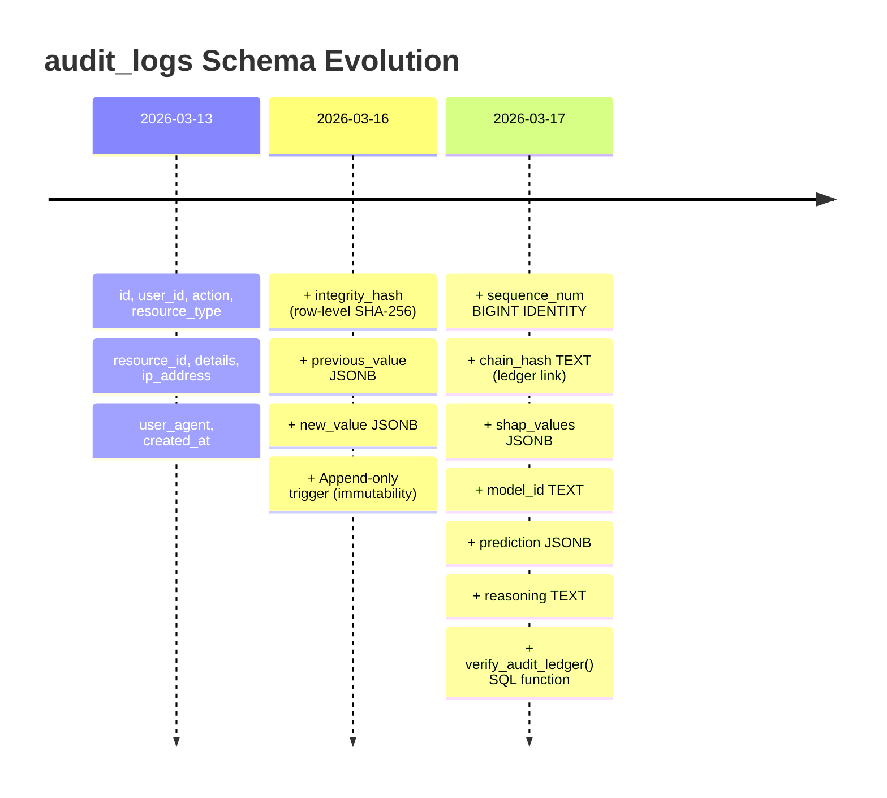

---

## File Reference

| File | Purpose |
|------|---------|
| [migrations/20260313091500_auth_audit_logs.sql](next-fastapi-conversion/supabase/migrations/20260313091500_auth_audit_logs.sql) | `auth_audit` table + RLS policies + ATNA codes |
| [migrations/20251116145514_...sql](next-fastapi-conversion/supabase/migrations/20251116145514_03b8c065-31f2-46c1-a062-a1f2e4363a04.sql) | `audit_logs` table + RLS policies (original) |
| [migrations/20260316000000_auth_audit_user_id_fk.sql](next-fastapi-conversion/supabase/migrations/20260316000000_auth_audit_user_id_fk.sql) | FK referential integrity for `auth_audit` |
| [migrations/20260316000001_audit_immutability.sql](next-fastapi-conversion/supabase/migrations/20260316000001_audit_immutability.sql) | Append-only triggers + `integrity_hash` column on `audit_logs` |
| [migrations/20260316000002_audit_logs_change_tracking.sql](next-fastapi-conversion/supabase/migrations/20260316000002_audit_logs_change_tracking.sql) | `previous_value` + `new_value` columns + GIN index |
| [migrations/20260316000005_rename_auth_audit_admin_policy.sql](next-fastapi-conversion/supabase/migrations/20260316000005_rename_auth_audit_admin_policy.sql) | Policy name correction |
| **[migrations/20260317000002_audit_ledger_shap.sql](next-fastapi-conversion/supabase/migrations/20260317000002_audit_ledger_shap.sql)** | **Cryptographic ledger: `sequence_num`, `chain_hash`, SHAP columns, chain trigger, `verify_audit_ledger()`** |
| **[migrations/20260317000003_verify_audit_ledger_fix.sql](next-fastapi-conversion/supabase/migrations/20260317000003_verify_audit_ledger_fix.sql)** | **Hotfix: `verify_audit_ledger()` handles pre-migration NULL chain rows** |
| [migrations/20260312193000_fnf9_schema_closure.sql](next-fastapi-conversion/supabase/migrations/20260312193000_fnf9_schema_closure.sql) | Role enum + `user_roles` + `roles` tables |
| [migrations/20260312194000_fnf10_rls_hardening.sql](next-fastapi-conversion/supabase/migrations/20260312194000_fnf10_rls_hardening.sql) | RLS hardening pass |
| [migrations/20260317100000_tenant_scope_rls_hardening.sql](next-fastapi-conversion/supabase/migrations/20260317100000_tenant_scope_rls_hardening.sql) | Tenant-scope RLS hardening for `app_users`, `tenants`, `user_roles`, and `devices` |
| [frontend/src/app-pages/Activity.tsx](next-fastapi-conversion/frontend/src/app-pages/Activity.tsx) | Activity log UI page — Auth Events + System Events tabs, `ShapFactors` component |
| [frontend/src/lib/auditHash.ts](next-fastapi-conversion/frontend/src/lib/auditHash.ts) | SHA-256 integrity hash utility (`auth_audit`) |
| [frontend/src/app-pages/Auth.tsx](next-fastapi-conversion/frontend/src/app-pages/Auth.tsx) | Login/logout with audit writes |
| [frontend/src/components/Layout.tsx](next-fastapi-conversion/frontend/src/components/Layout.tsx) | Logout audit event |
| [frontend/src/components/admin/PodActivationRequests.tsx](next-fastapi-conversion/frontend/src/components/admin/PodActivationRequests.tsx) | Pod approve/reject with audit |
| [frontend/src/components/AppSidebar.tsx](next-fastapi-conversion/frontend/src/components/AppSidebar.tsx) | Role-filtered navigation |
| [frontend/src/hooks/useUserRole.ts](next-fastapi-conversion/frontend/src/hooks/useUserRole.ts) | Role detection hook |
| [backend/app/routes/admin.py](next-fastapi-conversion/backend/app/routes/admin.py) | Admin API endpoints — writes audit rows with `previous_value`/`new_value` |
| [backend/app/routes/activity.py](next-fastapi-conversion/backend/app/routes/activity.py) | `GET /api/activity/system` — serves `audit_logs` rows with SHAP fields |
| [backend/app/routes/device.py](next-fastapi-conversion/backend/app/routes/device.py) | Device routes — writes audit rows |
| [backend/app/routes/tenants.py](next-fastapi-conversion/backend/app/routes/tenants.py) | Tenant provisioning — writes audit rows |
| [backend/app/routes/pod_activation.py](next-fastapi-conversion/backend/app/routes/pod_activation.py) | Pod approve/reject — writes audit rows |
| [backend/tests/test_tenants_production.py](next-fastapi-conversion/backend/tests/test_tenants_production.py) | Tenant provisioning reliability, rollback, and idempotency tests |
| [backend/tests/test_tenant_provisioning_sla.py](next-fastapi-conversion/backend/tests/test_tenant_provisioning_sla.py) | SLA evidence tests: warm-path `<3s` and onboarding metadata contract checks |
| **[backend/app/core/supabase.py](next-fastapi-conversion/backend/app/core/supabase.py)** | **`insert_audit_log()` — central audit write: SHA-256, PII scrub, SHAP fields** |
| **[backend/app/logger/__init__.py](next-fastapi-conversion/backend/app/logger/__init__.py)** | **`generate_shap_reasoning()`, `log_ai_decision_audit()` + structured request logging + two-pass Presidio PII scrubber** |
| [backend/requirements.txt](next-fastapi-conversion/backend/requirements.txt) | presidio-analyzer, presidio-anonymizer, spacy, en-core-web-sm |
| [frontend/src/logger/index.ts](next-fastapi-conversion/frontend/src/logger/index.ts) | Pino logger — two-pass PII scrubber (field-name + regex content scan) |

---

*Documentation generated for Fideon OS — Activity Logs Feature*
*Updated 2026-03-17: Added Cryptographic Audit Ledger (sections 21–24), SHAP AI Explainability (section 22), Backend Audit Write Architecture (section 23), Migration History (section 25), tenant-scope RLS hardening, and provisioning SLA evidence tests.*
*All diagrams use [Mermaid](https://mermaid.js.org/) syntax and render in GitHub, GitLab, and most Markdown viewers.*
