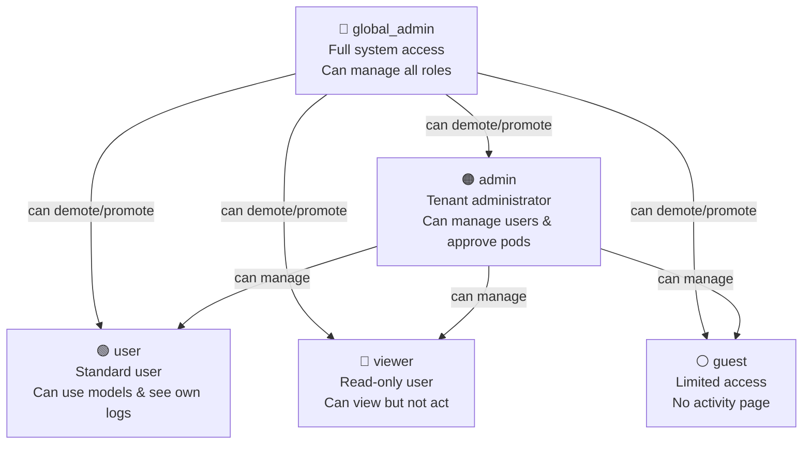
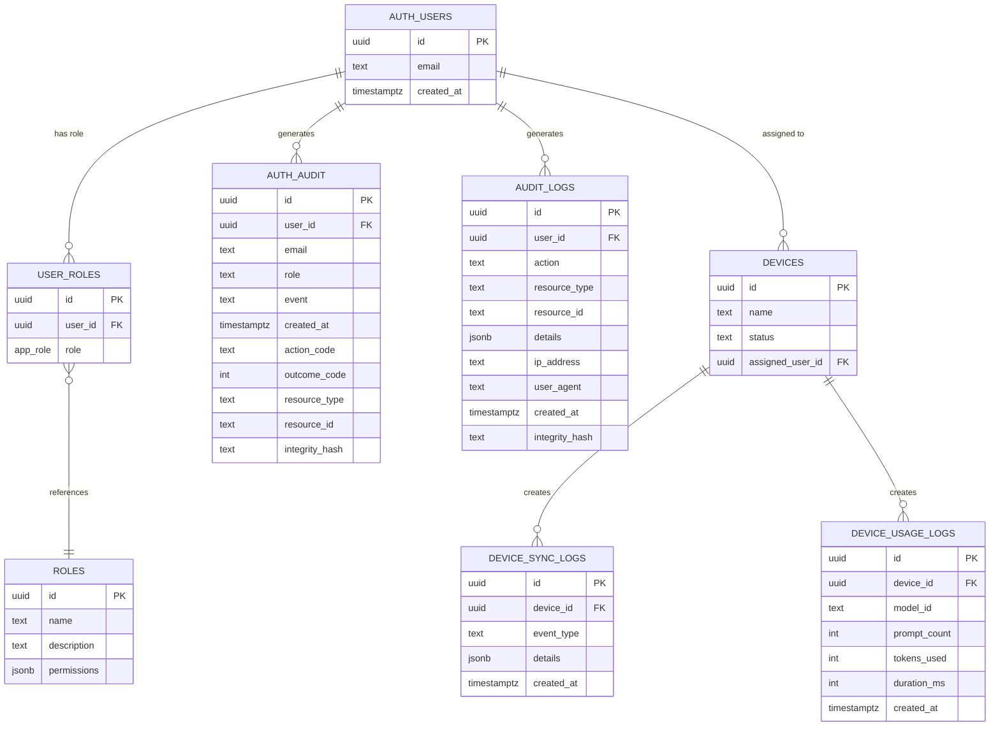
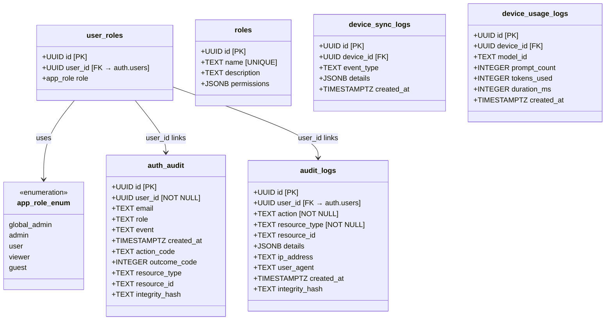
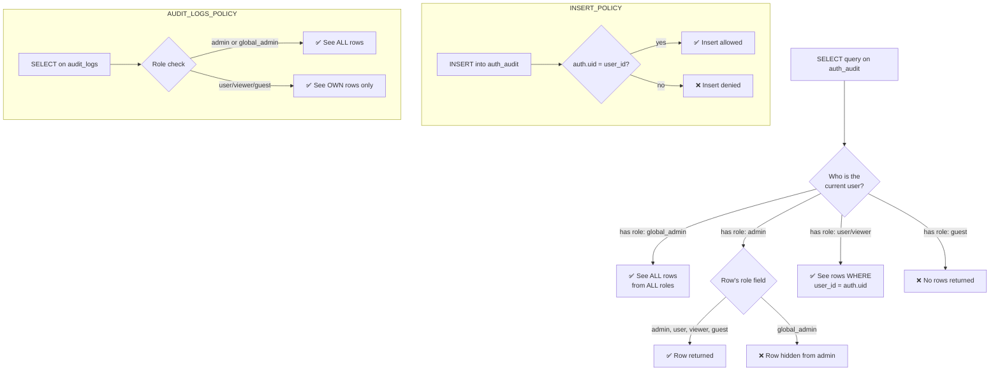
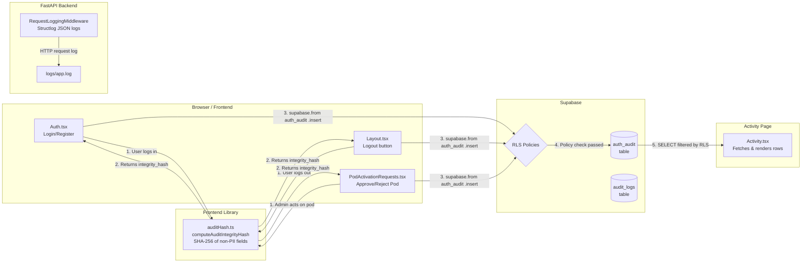
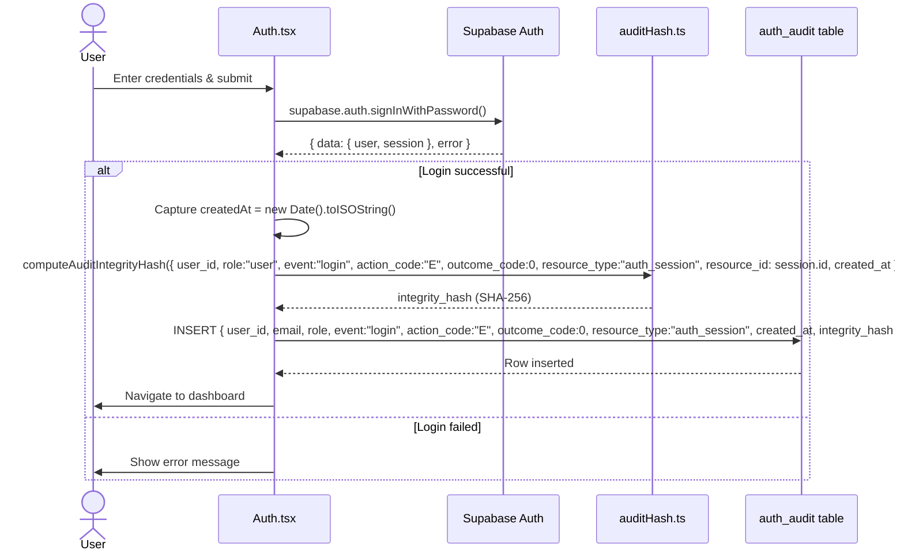
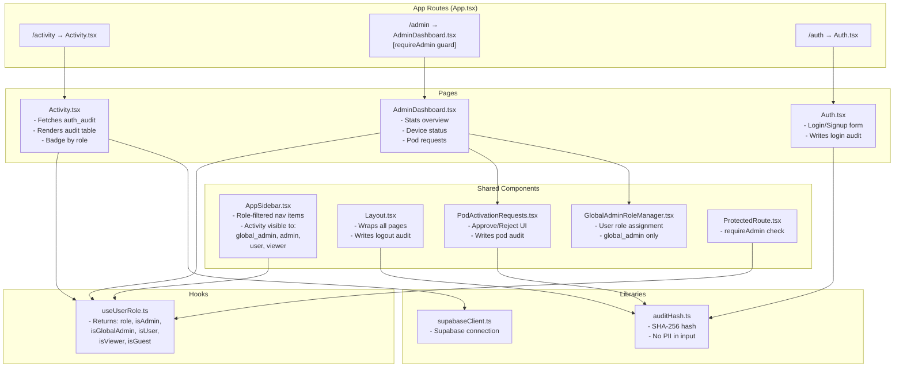
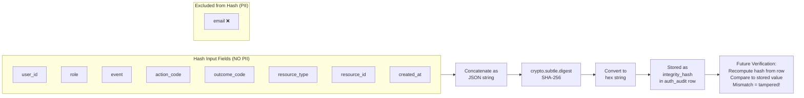
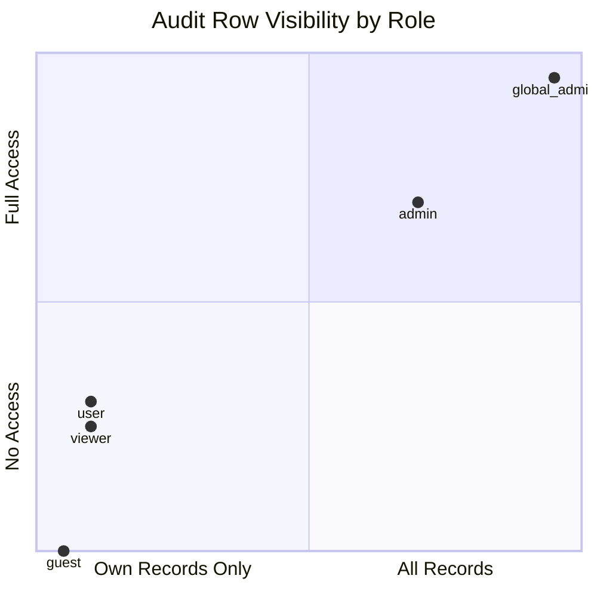
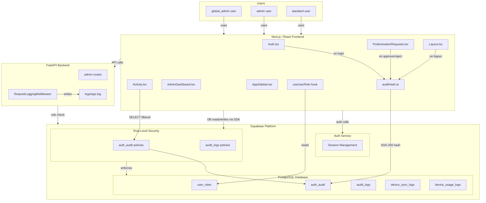

# Activity Logs Feature — Full Documentation

> **Project:** Neura-Box Cloud
> **Feature:** Activity Logs & Audit Trail System
> **Roles Covered:** `global_admin`, `admin`, `user`
> **Date:** 2026-03-16

---

## Table of Contents

1. [Feature Overview](#1-feature-overview)
2. [Role Definitions & Hierarchy](#2-role-definitions--hierarchy)
3. [Feature Capabilities by Role](#3-feature-capabilities-by-role)
4. [Database Schema — Supabase Tables](#4-database-schema--supabase-tables)
5. [ER Diagram (Entity-Relationship)](#5-er-diagram-entity-relationship)
6. [Schema Diagram — Supabase Column-Level Detail](#6-schema-diagram--supabase-column-level-detail)
7. [Row-Level Security (RLS) Policy Diagram](#7-row-level-security-rls-policy-diagram)
8. [Data Flow Diagram — How Logs Are Created](#8-data-flow-diagram--how-logs-are-created)
9. [Sequence Diagram — Login Audit Event](#9-sequence-diagram--login-audit-event)
10. [Sequence Diagram — Admin Approves Pod](#10-sequence-diagram--admin-approves-pod)
11. [Sequence Diagram — Viewing Activity Logs](#11-sequence-diagram--viewing-activity-logs)
12. [Component Architecture Diagram](#12-component-architecture-diagram)
13. [Audit Integrity Hash Flow](#13-audit-integrity-hash-flow)
14. [Event Types Reference](#14-event-types-reference)
15. [ATNA Standard Code Reference](#15-atna-standard-code-reference)
16. [Access Control Matrix](#16-access-control-matrix)
17. [Navigation & Route Guard Diagram](#17-navigation--route-guard-diagram)
18. [Backend Logging Architecture](#18-backend-logging-architecture)
19. [Full System Interaction Diagram](#19-full-system-interaction-diagram)
20. [PII Detection — Presidio & Regex](#20-pii-detection--presidio--regex)

---

## 1. Feature Overview

The **Activity Logs** system provides a tamper-evident, role-scoped audit trail of all significant actions taken across the Neura-Box Cloud platform. It is built on **two Supabase tables** (`auth_audit` and `audit_logs`), enforced by PostgreSQL **Row-Level Security (RLS)** policies, and surfaced to users via the `/activity` frontend page.

### Core Design Principles

| Principle | Implementation |
|-----------|---------------|
| **Tamper-Evidence** | Each `auth_audit` row stores a SHA-256 `integrity_hash` computed from non-PII fields |
| **Privacy** | PII (email, name) is excluded from hash computation; backend logs use PII scrubbing |
| **Least Privilege** | Each role sees only what they are authorized to see via RLS policies |
| **ATNA Compliance** | Action codes (C/R/U/D/E) and outcome codes (0/4/8/12) follow ATNA audit standards |
| **Immutability** | Audit rows have no UPDATE/DELETE RLS policies — records cannot be altered once written |

---

## 2. Role Definitions & Hierarchy



### Role Descriptions

| Role | Enum Value | Description |
|------|-----------|-------------|
| `global_admin` | `'global_admin'` | Platform-level superuser. Can see ALL audit records from all roles, assign any role, create users. The only role whose audit rows are hidden from regular admins. |
| `admin` | `'admin'` | Tenant/organization administrator. Can approve/reject pod activation requests, view audit records for `admin`, `user`, `viewer`, and `guest` roles. Cannot see `global_admin` audit rows. |
| `user` | `'user'` | Standard platform user. Can use AI models, submit pod activation requests, and view only their own activity logs. |
| `viewer` | `'viewer'` | Read-only role. Can view dashboards and their own logs but cannot trigger actions. |
| `guest` | `'guest'` | Most restricted. No access to the Activity page. Can only view their own audit rows via direct DB access. |

---

## 3. Feature Capabilities by Role

### Activity Page (`/activity`)

| Capability | global_admin | admin | user | viewer | guest |
|-----------|:---:|:---:|:---:|:---:|:---:|
| Access `/activity` page | ✅ | ✅ | ✅ | ✅ | ❌ |
| View own audit rows | ✅ | ✅ | ✅ | ✅ | ❌ |
| View all `user` role rows | ✅ | ✅ | ❌ | ❌ | ❌ |
| View all `admin` role rows | ✅ | ✅ | ❌ | ❌ | ❌ |
| View all `viewer` role rows | ✅ | ✅ | ❌ | ❌ | ❌ |
| View all `guest` role rows | ✅ | ✅ | ❌ | ❌ | ❌ |
| View `global_admin` role rows | ✅ | ❌ | ❌ | ❌ | ❌ |

### Audit Events Generated

| Event | global_admin | admin | user | viewer | guest |
|-------|:---:|:---:|:---:|:---:|:---:|
| `login` logged | ✅ | ✅ | ✅ | ✅ | ✅ |
| `logout` logged | ✅ | ✅ | ✅ | ✅ | ✅ |
| `approve_pod:{model_id}` logged | ✅ | ✅ | ❌ | ❌ | ❌ |
| `reject_pod:{model_id}` logged | ✅ | ✅ | ❌ | ❌ | ❌ |

### Admin Capabilities

| Capability | global_admin | admin | user |
|-----------|:---:|:---:|:---:|
| View Admin Dashboard | ✅ | ✅ | ❌ |
| View Devices | ✅ | ✅ | ❌ |
| View Pending Approvals | ✅ | ✅ | ❌ |
| Approve/Reject Pod Requests | ✅ | ✅ | ❌ |
| List all users | ✅ | ✅ | ❌ |
| Create users | ✅ | ✅ | ❌ |
| Set user roles | ✅ | ❌ | ❌ |

---

## 4. Database Schema — Supabase Tables

### 4.1 `public.auth_audit` — Primary Activity Log Table

```sql
CREATE TABLE public.auth_audit (
    id              UUID        PRIMARY KEY DEFAULT gen_random_uuid(),
    user_id         UUID        NOT NULL,
    email           TEXT,
    role            TEXT,
    event           TEXT,
    created_at      TIMESTAMPTZ DEFAULT now(),
    action_code     TEXT,        -- ATNA: C, R, U, D, E
    outcome_code    INTEGER,     -- ATNA: 0, 4, 8, 12
    resource_type   TEXT,        -- e.g. auth_session, pod_activation
    resource_id     TEXT,
    integrity_hash  TEXT         -- SHA-256 of non-PII fields
);
```

**Row-Level Security:** ENABLED
**Indexes:** implicit on `id` (primary key)

---

### 4.2 `public.audit_logs` — Generic Audit Log Table

```sql
CREATE TABLE public.audit_logs (
    id              UUID        PRIMARY KEY DEFAULT gen_random_uuid(),
    user_id         UUID        REFERENCES auth.users(id),
    action          TEXT        NOT NULL,
    resource_type   TEXT        NOT NULL,
    resource_id     TEXT,
    details         JSONB,
    ip_address      TEXT,
    user_agent      TEXT,
    created_at      TIMESTAMPTZ DEFAULT now(),
    integrity_hash  TEXT         -- SHA-256 of: user_id, action, resource_type, resource_id, created_at
);

CREATE INDEX idx_audit_logs_user_id       ON public.audit_logs (user_id);
CREATE INDEX idx_audit_logs_resource_type ON public.audit_logs (resource_type);
CREATE INDEX idx_audit_logs_created_at    ON public.audit_logs (created_at DESC);
```

**Row-Level Security:** ENABLED

---

### 4.3 `public.user_roles` — Role Assignment Table

```sql
CREATE TABLE public.user_roles (
    id        UUID     PRIMARY KEY DEFAULT gen_random_uuid(),
    user_id   UUID     NOT NULL REFERENCES auth.users(id) ON DELETE CASCADE,
    role      app_role NOT NULL,
    UNIQUE (user_id, role)
);
```

---

### 4.4 `public.roles` — Role Metadata Table

```sql
CREATE TABLE public.roles (
    id          UUID    PRIMARY KEY DEFAULT gen_random_uuid(),
    name        TEXT    UNIQUE NOT NULL,
    description TEXT,
    permissions JSONB
);
```

---

### 4.5 `public.device_sync_logs` — Device Sync Activity

```sql
CREATE TABLE public.device_sync_logs (
    id          UUID        PRIMARY KEY DEFAULT gen_random_uuid(),
    device_id   UUID        REFERENCES devices(id),
    event_type  TEXT,        -- check_in, model_sync, config_update
    details     JSONB,
    created_at  TIMESTAMPTZ DEFAULT now()
);
```

---

### 4.6 `public.device_usage_logs` — AI Model Usage Tracking

```sql
CREATE TABLE public.device_usage_logs (
    id           UUID        PRIMARY KEY DEFAULT gen_random_uuid(),
    device_id    UUID        REFERENCES devices(id),
    model_id     TEXT,
    prompt_count INTEGER,
    tokens_used  INTEGER,
    duration_ms  INTEGER,
    created_at   TIMESTAMPTZ DEFAULT now()
);
```

---

## 5. ER Diagram (Entity-Relationship)



---

## 6. Schema Diagram — Supabase Column-Level Detail



---

## 7. Row-Level Security (RLS) Policy Diagram



### RLS Policies Summary Table

| Table | Policy Name | Operation | Who | Condition |
|-------|------------|-----------|-----|-----------|
| `auth_audit` | Users insert own | INSERT | Any authenticated | `auth.uid() = user_id` |
| `auth_audit` | Users see own | SELECT | user/viewer/guest | `user_id = auth.uid()` |
| `auth_audit` | Admins see user+admin | SELECT | admin | `role IN ('admin','user','viewer','guest')` |
| `auth_audit` | Global admins see all | SELECT | global_admin | No restriction |
| `audit_logs` | System can insert | INSERT | Any | `true` (system writes) |
| `audit_logs` | Users see own | SELECT | Any | `auth.uid() = user_id` |
| `audit_logs` | Admins view all | SELECT | admin/global_admin | `has_role(auth.uid(), 'admin')` |
| `device_sync_logs` | Admins only view | SELECT | admin/global_admin | `has_role(auth.uid(), 'admin')` |
| `device_usage_logs` | Admins only view | SELECT | admin/global_admin | `has_role(auth.uid(), 'admin')` |

---

## 8. Data Flow Diagram — How Logs Are Created



---

## 9. Sequence Diagram — Login Audit Event



---

## 10. Sequence Diagram — Admin Approves Pod

```mermaid
sequenceDiagram
    actor Admin
    participant PAR as PodActivationRequests.tsx
    participant Supa as Supabase DB
    participant Hash as auditHash.ts
    participant AA as auth_audit table
    participant PODS as pod_activation_requests table

    Admin->>PAR: Click "Approve" on pod request
    PAR->>Supa: getUser() — verify session
    Supa-->>PAR: { user }

    PAR->>Supa: UPDATE pod_activation_requests\nSET status='approved'\nWHERE id = request.id
    Supa-->>PAR: Updated

    PAR->>PAR: createdAt = new Date().toISOString()
    PAR->>Hash: computeAuditIntegrityHash({ user_id, role:"admin", event:"approve_pod:{model_id}", action_code:"U", outcome_code:0, resource_type:"pod_activation", resource_id: request.id, created_at })
    Hash-->>PAR: integrity_hash (SHA-256)

    PAR->>AA: INSERT { user_id, email, role:"admin", event:"approve_pod:{model_id}", action_code:"U", outcome_code:0, resource_type:"pod_activation", resource_id, created_at, integrity_hash }
    AA-->>PAR: Row inserted

    PAR->>Admin: Toast: "Pod approved successfully"
```

---

## 11. Sequence Diagram — Viewing Activity Logs

```mermaid
sequenceDiagram
    actor Actor as User / Admin / Global Admin
    participant ACT as Activity.tsx
    participant RLS as Supabase RLS
    participant AA as auth_audit table

    Actor->>ACT: Navigate to /activity
    ACT->>ACT: useEffect — fetch on mount

    ACT->>RLS: SELECT * FROM auth_audit\nORDER BY created_at DESC
    RLS->>RLS: Evaluate caller's role

    alt Caller is global_admin
        RLS-->>ACT: ALL rows (all roles)
    else Caller is admin
        RLS-->>ACT: Rows WHERE role IN\n('admin','user','viewer','guest')
    else Caller is user / viewer
        RLS-->>ACT: Rows WHERE user_id = auth.uid()
    else Caller is guest
        RLS-->>ACT: 0 rows (policy not matched)
    end

    ACT->>ACT: setRows(data)\nRender table with badges
    ACT->>Actor: Display filtered activity log
```

---

## 12. Component Architecture Diagram



---

## 13. Audit Integrity Hash Flow



### Why Integrity Hash Matters

- Any modification to a row's `user_id`, `role`, `event`, `action_code`, `outcome_code`, `resource_type`, `resource_id`, or `created_at` will cause the recomputed hash to differ from the stored `integrity_hash`.
- This allows auditors to detect **post-write tampering** even if the row is somehow modified directly in the database.
- Email is excluded from the hash to protect PII in the hash itself (email is still stored in the row but not hashed).

---

## 14. Event Types Reference

| Event | Trigger | Actor | action_code | outcome_code | resource_type |
|-------|---------|-------|:-----------:|:------------:|---------------|
| `login` | Successful sign-in | Any role | `E` (Execute) | `0` (Success) | `auth_session` |
| `logout` | Sign-out click | Any role | `E` (Execute) | `0` (Success) | `auth_session` |
| `approve_pod:{model_id}` | Admin approves pod activation | admin / global_admin | `U` (Update) | `0` (Success) | `pod_activation` |
| `reject_pod:{model_id}` | Admin rejects pod activation | admin / global_admin | `U` (Update) | `0` (Success) | `pod_activation` |

---

## 15. ATNA Standard Code Reference

### Action Codes

| Code | Meaning | Used For |
|------|---------|---------|
| `C` | Create | Creating new resources |
| `R` | Read | Reading/viewing records |
| `U` | Update | Modifying existing records (pod approve/reject) |
| `D` | Delete | Deleting records |
| `E` | Execute | Executing operations (login, logout) |

### Outcome Codes

| Code | Meaning | Severity |
|------|---------|---------|
| `0` | Success | None — operation completed normally |
| `4` | Minor failure | Low — minor issue occurred |
| `8` | Serious failure | High — significant problem |
| `12` | Major failure | Critical — severe error |

---

## 16. Access Control Matrix

### `/activity` Page — What Each Role Sees



### Detailed Access Matrix

| Data Scope | global_admin | admin | user | viewer | guest |
|-----------|:---:|:---:|:---:|:---:|:---:|
| Own `auth_audit` rows | ✅ | ✅ | ✅ | ✅ | ❌ (page blocked) |
| All `user` role rows | ✅ | ✅ | ❌ | ❌ | ❌ |
| All `admin` role rows | ✅ | ✅ | ❌ | ❌ | ❌ |
| All `viewer` role rows | ✅ | ✅ | ❌ | ❌ | ❌ |
| All `guest` role rows | ✅ | ✅ | ❌ | ❌ | ❌ |
| `global_admin` role rows | ✅ | ❌ | ❌ | ❌ | ❌ |
| All `audit_logs` rows | ✅ | ✅ | ❌ | ❌ | ❌ |
| Own `audit_logs` rows | ✅ | ✅ | ✅ | ✅ | ✅ |
| `device_sync_logs` | ✅ | ✅ | ❌ | ❌ | ❌ |
| `device_usage_logs` | ✅ | ✅ | ❌ | ❌ | ❌ |

### API Endpoint Access Matrix

| Endpoint | global_admin | admin | user | viewer | guest |
|---------|:---:|:---:|:---:|:---:|:---:|
| `GET /api/list-users` | ✅ | ✅ | ❌ | ❌ | ❌ |
| `POST /api/admin-create-user` | ✅ | ✅ | ❌ | ❌ | ❌ |
| `POST /api/admin-set-user-role` | ✅ | ❌ | ❌ | ❌ | ❌ |

---

## 17. Navigation & Route Guard Diagram

```mermaid
flowchart TD
    START([User navigates to URL])
    START --> AUTH_CHK{Is user\nauthenticated?}

    AUTH_CHK -->|No| LOGIN[Redirect to /auth]
    AUTH_CHK -->|Yes| ROLE_FETCH[Fetch role from\nuser_roles table]

    ROLE_FETCH --> ROUTE{Which route?}

    ROUTE -->|/activity| ACT_CHK{Role is\nglobal_admin, admin,\nuser, or viewer?}
    ROUTE -->|/admin| ADMIN_CHK{requireAdmin:\nrole is admin\nor global_admin?}
    ROUTE -->|/devices| ADMIN_CHK
    ROUTE -->|/devices/pending| ADMIN_CHK

    ACT_CHK -->|Yes| SHOW_ACT[Show Activity.tsx\nFiltered by RLS]
    ACT_CHK -->|No (guest)| REDIRECT[Not shown in sidebar\nRedirect if direct nav]

    ADMIN_CHK -->|Yes| SHOW_ADMIN[Show Admin page]
    ADMIN_CHK -->|No| DENY[Redirect to /]

    subgraph SIDEBAR_RENDER["Sidebar Navigation Rendering"]
        SB_ACT[Activity — shown to:\nglobal_admin, admin, user, viewer]
        SB_ADMIN[Admin Dashboard — shown to:\nadmin, global_admin]
        SB_DEVICES[Devices — shown to:\nadmin, global_admin]
        SB_PENDING[Pending Approvals — shown to:\nadmin, global_admin]
    end
```

---

## 18. Backend Logging Architecture

```mermaid
flowchart LR
    subgraph FASTAPI["FastAPI Application"]
        FACTORY[factory.py\napp = create_app()]
        MW[RequestLoggingMiddleware]
        ROUTES[API Routes\nadmin.py, etc.]
    end

    subgraph LOGGER["Logger Module (logger/__init__.py)"]
        STRUCTLOG[structlog\nJSON formatter]
        PII[PII Scrubber — Pass 1\nField-name match → REDACTED\nMasks: email → u***@domain]
        PRESIDIO[Presidio — Pass 2\nContent scan: PERSON, EMAIL,\nPHONE, CREDIT_CARD, SSN,\nIBAN, LOCATION]
    end

    subgraph OUTPUT["Log Output"]
        CONSOLE[Console\nJSON output]
        FILE[logs/app.log\nJSON lines]
    end

    subgraph LOG_FIELDS["Per-Request Log Fields"]
        LF1[request_id: UUID]
        LF2[method: GET/POST/etc]
        LF3[path: /api/...]
        LF4[client_ip: x.x.x.x]
        LF5[status_code: 200/401/etc]
        LF6[duration_ms: float]
    end

    FACTORY --> MW
    MW --> ROUTES
    MW --> STRUCTLOG
    STRUCTLOG --> PII
    PII --> PRESIDIO
    PRESIDIO --> CONSOLE
    PRESIDIO --> FILE

    MW --> LOG_FIELDS
```

### Backend vs Frontend Logging Comparison

| Aspect | Frontend (`auth_audit` table) | Backend (`logs/app.log`) |
|--------|------------------------------|-------------------------|
| Storage | Supabase PostgreSQL | Local file system |
| Format | Structured table rows | JSON lines (structlog) |
| PII Handling — Pass 1 | Email stored, excluded from hash | Field-name keyword match → `[REDACTED]`; email → `u***@domain` |
| PII Handling — Pass 2 | Regex content scan (SSN, card, phone, IBAN) | **Presidio** content scan (PERSON, EMAIL, PHONE, CREDIT_CARD, US_SSN, IBAN, LOCATION) |
| Tamper Evidence | SHA-256 integrity hash | No hash (file-based) |
| Queryable | Yes — via Supabase SQL/RLS | No — file read only |
| Retention | Permanent (no delete policy) | File rotation (app-level) |
| Visibility | Role-filtered via RLS | Server-side only |

---

## 19. Full System Interaction Diagram



---

## 20. PII Detection — Presidio & Regex

All log data passes through a **two-pass PII scrubbing pipeline** before being written to any output, implemented in `backend/app/logger/__init__.py` (Python) and `frontend/src/logger/index.ts` (TypeScript).

### Pass 1 — Field-name Keyword Match (fast)

Every key in the log payload is compared (case-insensitive) against a hard-coded set of sensitive field names. A match unconditionally replaces the value with `[REDACTED]`.

**Covered fields (20 total):** `password`, `passwd`, `secret`, `token`, `api_key`, `authorization`, `ssn`, `social_security`, `credit_card`, `card_number`, `cvv`, `dob`, `date_of_birth`, `birth_date`, `full_name`, `first_name`, `last_name`, `mobile`, `phone`, `phone_number`, `address`

### Pass 2 — Content-based PII Detection (deep scan)

After field-name scrubbing, all remaining **string values** are scanned for PII content — catching sensitive data inside generic fields like `message` or `details` regardless of the key name.

#### Email Pre-masking (shared — both backend & frontend)

Before the deep scan, email addresses are masked to `u***@domain.com` format (cheaper than NLP/regex scan).

#### Backend — Microsoft Presidio (Python)

```python
from presidio_analyzer import AnalyzerEngine
from presidio_anonymizer import AnonymizerEngine
from presidio_anonymizer.entities import OperatorConfig

_analyzer = AnalyzerEngine()   # uses spaCy en_core_web_sm model
_anonymizer = AnonymizerEngine()
```

Detected entities are replaced with `<ENTITY_TYPE>` placeholders via `OperatorConfig("replace")`.

**Graceful degradation:** If Presidio or the spaCy model is unavailable, `_PRESIDIO_AVAILABLE = False` and only Pass 1 runs — no exception is raised.

#### Frontend — Regex Patterns (TypeScript)

```typescript
const PII_PATTERNS: PiiPattern[] = [
  { label: "US_SSN",       regex: /\b\d{3}-\d{2}-\d{4}\b/g },
  { label: "CREDIT_CARD",  regex: /\b(?:\d[ -]?){13,15}\d\b/g },
  { label: "PHONE_NUMBER", regex: /(?:\+\d{1,3}[\s.-]?)?(?:\(?\d{3}\)?[\s.-]?)(?:\d{3}[\s.-]?\d{4})/g },
  { label: "EMAIL_ADDRESS", regex: /[a-zA-Z0-9._%+\-]+@[a-zA-Z0-9.\-]+\.[a-zA-Z]{2,}/g },
  { label: "IBAN_CODE",    regex: /\b[A-Z]{2}\d{2}[A-Z0-9]{4}\d{7}(?:[A-Z0-9]?){0,16}\b/g },
];
```

No ML model required — runs in browser or Node.js with zero additional dependencies.

### Entity Type Reference

| Entity Type | Example Input | Replacement | Backend | Frontend |
|-------------|--------------|-------------|---------|----------|
| `PERSON` | John Smith | `<PERSON>` | Presidio NLP | — |
| `EMAIL_ADDRESS` | user@example.com | `u***@example.com` | Email mask + Presidio | Email mask + regex |
| `PHONE_NUMBER` | +1 (555) 123-4567 | `<PHONE_NUMBER>` | Presidio NLP | Regex |
| `CREDIT_CARD` | 4111 1111 1111 1111 | `<CREDIT_CARD>` | Presidio NLP | Regex |
| `US_SSN` | 123-45-6789 | `<US_SSN>` | Presidio NLP | Regex |
| `IBAN_CODE` | GB29NWBK60161331926819 | `<IBAN_CODE>` | Presidio NLP | Regex |
| `LOCATION` | New York, NY | `<LOCATION>` | Presidio NLP | — |
| `IP_ADDRESS` | 192.168.1.1 | *(kept)* | Intentionally excluded | — |

> **Note:** `IP_ADDRESS` is excluded from Presidio detection — client IPs are useful for security forensics in HTTP request logs.

### Backend Dependencies (`requirements.txt`)

```
presidio-analyzer>=2.2.0
presidio-anonymizer>=2.2.0
spacy>=3.4.0,<4.0.0
en-core-web-sm @ https://github.com/explosion/spacy-models/releases/download/en_core_web_sm-3.7.1/en_core_web_sm-3.7.1-py3-none-any.whl
```

### Installation

```bash
pip install -r requirements.txt
# or manually:
pip install presidio-analyzer presidio-anonymizer spacy
python -m spacy download en_core_web_sm
```

---

## File Reference

| File | Purpose |
|------|---------|
| [migrations/20260313091500_auth_audit_logs.sql](next-fastapi-conversion/supabase/migrations/20260313091500_auth_audit_logs.sql) | `auth_audit` table + RLS policies |
| [migrations/20251116145514_...sql](next-fastapi-conversion/supabase/migrations/20251116145514_03b8c065-31f2-46c1-a062-a1f2e4363a04.sql) | `audit_logs` table + RLS policies |
| [migrations/20260312193000_fnf9_schema_closure.sql](next-fastapi-conversion/supabase/migrations/20260312193000_fnf9_schema_closure.sql) | Role enum + `user_roles` + `roles` tables |
| [migrations/20260312194000_fnf10_rls_hardening.sql](next-fastapi-conversion/supabase/migrations/20260312194000_fnf10_rls_hardening.sql) | RLS hardening pass |
| [frontend/src/app-pages/Activity.tsx](next-fastapi-conversion/frontend/src/app-pages/Activity.tsx) | Activity log UI page |
| [frontend/src/lib/auditHash.ts](next-fastapi-conversion/frontend/src/lib/auditHash.ts) | SHA-256 integrity hash utility |
| [frontend/src/app-pages/Auth.tsx](next-fastapi-conversion/frontend/src/app-pages/Auth.tsx) | Login/logout with audit writes |
| [frontend/src/components/Layout.tsx](next-fastapi-conversion/frontend/src/components/Layout.tsx) | Logout audit event |
| [frontend/src/components/admin/PodActivationRequests.tsx](next-fastapi-conversion/frontend/src/components/admin/PodActivationRequests.tsx) | Pod approve/reject with audit |
| [frontend/src/components/AppSidebar.tsx](next-fastapi-conversion/frontend/src/components/AppSidebar.tsx) | Role-filtered navigation |
| [frontend/src/hooks/useUserRole.ts](next-fastapi-conversion/frontend/src/hooks/useUserRole.ts) | Role detection hook |
| [backend/app/routes/admin.py](next-fastapi-conversion/backend/app/routes/admin.py) | Admin API endpoints |
| [backend/app/logger/__init__.py](next-fastapi-conversion/backend/app/logger/__init__.py) | Structured request logging — two-pass Presidio PII scrubber (field-name + NLP) |
| [backend/requirements.txt](next-fastapi-conversion/backend/requirements.txt) | presidio-analyzer, presidio-anonymizer, spacy, en-core-web-sm |
| [frontend/src/logger/index.ts](next-fastapi-conversion/frontend/src/logger/index.ts) | Pino logger — two-pass PII scrubber (field-name + regex content scan) |

---

*Documentation generated for Neura-Box Cloud — Activity Logs Feature*
*All diagrams use [Mermaid](https://mermaid.js.org/) syntax and render in GitHub, GitLab, and most Markdown viewers.*
